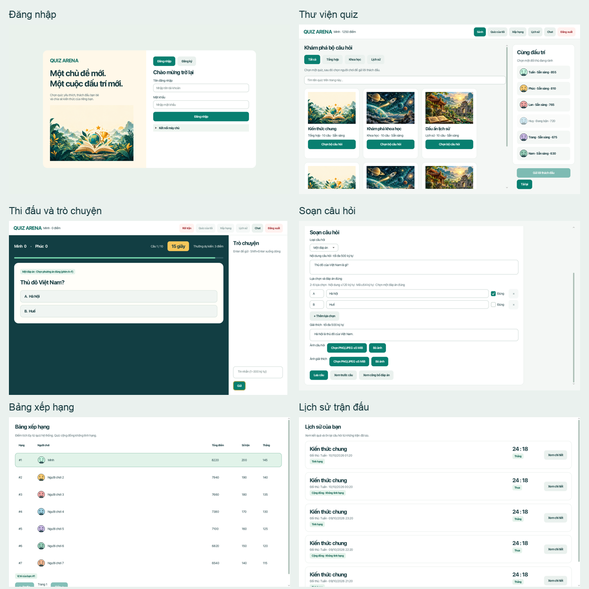

# Quiz Arena — Ứng dụng quiz đối kháng

Quiz Arena là ứng dụng desktop bằng Java, cho phép **hai người thi đấu quiz theo thời gian thực**. Người chơi có thể chọn bộ câu hỏi có sẵn hoặc tự tạo quiz, thêm ảnh cho câu hỏi và phần giải thích, mời đối thủ, trò chuyện và xem lại kết quả.

Ứng dụng dùng **JavaFX** cho giao diện, **TCP Socket** để trao đổi dữ liệu và **MySQL** để lưu tài khoản, quiz, lịch sử thi đấu. Server quyết định thời gian, đáp án, điểm số và kết quả trận đấu.



## Mục lục

- [1. Chức năng chính](#1-chức-năng-chính)
- [2. Công nghệ sử dụng](#2-công-nghệ-sử-dụng)
- [3. Kiến trúc hệ thống](#3-kiến-trúc-hệ-thống)
- [4. Cấu trúc dự án](#4-cấu-trúc-dự-án)
- [5. Cài đặt và chạy ứng dụng](#5-cài-đặt-và-chạy-ứng-dụng)
- [6. Hướng dẫn sử dụng](#6-hướng-dẫn-sử-dụng)
- [7. Logic thi đấu và tính điểm](#7-logic-thi-đấu-và-tính-điểm)
- [8. Logic tạo quiz và hiển thị ảnh](#8-logic-tạo-quiz-và-hiển-thị-ảnh)
- [9. Cơ sở dữ liệu và lưu kết quả](#9-cơ-sở-dữ-liệu-và-lưu-kết-quả)
- [10. Chạy qua mạng LAN](#10-chạy-qua-mạng-lan)
- [11. Kiểm thử](#11-kiểm-thử)
- [12. Lỗi thường gặp](#12-lỗi-thường-gặp)
- [13. Vận hành và giới hạn hiện tại](#13-vận-hành-và-giới-hạn-hiện-tại)
- [14. Tài liệu tham khảo trong dự án](#14-tài-liệu-tham-khảo-trong-dự-án)

## 1. Chức năng chính

| Nhóm | Chức năng |
| --- | --- |
| Tài khoản | Đăng ký, đăng nhập, tên hiển thị và ảnh đại diện |
| Sảnh chờ | Xem quiz theo danh mục, tìm trong trang đang hiển thị, xem người chơi trực tuyến |
| Thách đấu | Mời một người đang rảnh, chấp nhận, từ chối hoặc hủy lời mời |
| Thi đấu | Hai người cùng trả lời một bộ câu hỏi, đồng hồ đếm ngược, chấm điểm trên server |
| Câu hỏi | Một đáp án, nhiều đáp án, đúng/sai và trả lời ngắn |
| Quiz của tôi | Tạo bản nháp, sửa và sắp xếp câu hỏi, xem trước, xuất bản hoặc gỡ khỏi sảnh |
| Hình ảnh | Ảnh câu hỏi xuất hiện trước khi tính giờ; ảnh giải thích xuất hiện khi công bố đáp án |
| Trong trận | Chat với đối thủ, xem đáp án và bảng điểm sau từng câu |
| Sau trận | Xem kết quả, yêu cầu tái đấu, xem lịch sử và nội dung câu hỏi đã được phép xem |
| Xếp hạng | Tích lũy điểm từ các trận quiz hệ thống đủ điều kiện tính hạng |

### Hai loại quiz

| Tiêu chí | Quiz hệ thống | Quiz cộng đồng |
| --- | --- | --- |
| Nguồn | Dữ liệu có sẵn trong database | Người dùng tạo qua **Quiz của tôi** |
| Số câu mỗi trận | 10 câu | Toàn bộ 1–50 câu đã xuất bản |
| Cách chọn câu | Ngẫu nhiên: 4 câu một đáp án, 2 nhiều đáp án, 2 đúng/sai, 2 trả lời ngắn | Theo thứ tự tác giả hoặc xáo trộn nếu bật tùy chọn |
| Thời gian trả lời | 15 giây/câu | 15 giây/câu |
| Điểm tối đa | 30 điểm | 3 × số câu, tối đa 150 điểm |
| Bảng xếp hạng toàn cục | Có, theo kết quả trận đủ điều kiện | Không cập nhật các bộ đếm xếp hạng |
| Kết quả và lịch sử riêng | Có | Có, gồm điểm và kết quả thắng/thua/hòa của trận |

Dữ liệu mẫu có **3 bộ quiz và 60 câu hỏi**. Mỗi bộ có 20 câu để server chọn 10 câu theo cơ cấu trên.

## 2. Công nghệ sử dụng

Các phiên bản thư viện dưới đây được cấu hình trong các file `pom.xml` của dự án.

| Công nghệ | Phiên bản | Vai trò |
| --- | --- | --- |
| Java / JDK | 21 | Ngôn ngữ và môi trường chạy client, server |
| Maven | 3.9 trở lên | Quản lý thư viện, biên dịch, kiểm thử, đóng gói nhiều module |
| JavaFX | 21.0.6 | Giao diện desktop, điều khiển và hiệu ứng |
| JavaFX CSS | Đi kèm JavaFX | Màu sắc, kiểu chữ, bố cục trình bày của các thành phần |
| Java TCP Socket | Có sẵn trong JDK | Kết nối lâu dài giữa client và server |
| Jackson | 2.18.3 | Chuyển đổi đối tượng và thông điệp JSON |
| MySQL | 8.4 | Lưu dữ liệu quan hệ và nội dung JSON của câu hỏi |
| MySQL Connector/J | 8.4.0 | Driver JDBC, chỉ dùng phía server |
| JUnit | 5.11.4 | Kiểm thử đơn vị và tích hợp |
| PBKDF2-HMAC-SHA256 | Có sẵn trong JDK | Băm mật khẩu với salt riêng cho từng tài khoản |

Giao diện được viết bằng JavaFX; dự án không cần Node.js hay trình duyệt để chạy. Server sử dụng JDBC trực tiếp, không dùng Spring hoặc ORM.

## 3. Kiến trúc hệ thống

### Các thành phần và trách nhiệm

```text
┌────────────────────┐       TCP + JSON       ┌──────────────────────────┐
│ Client A — JavaFX  │ ◄────────────────────► │                          │
└────────────────────┘                        │      Quiz Server         │
                                              │                          │
┌────────────────────┐       TCP + JSON       │  Tài khoản, phiên, sảnh  │
│ Client B — JavaFX  │ ◄────────────────────► │  Thách đấu, trận, điểm   │
└────────────────────┘                        │  Quiz, ảnh, lưu kết quả  │
                                              └────────┬─────────┬───────┘
                                                       │ JDBC    │ Đọc/ghi
                                                       ▼         ▼
                                                  ┌────────┐ ┌────────────┐
                                                  │ MySQL  │ │ data/media │
                                                  └────────┘ └────────────┘
```

- **Client:** hiển thị dữ liệu, nhận thao tác và gửi yêu cầu. Đồng hồ, hiệu ứng và điểm hiển thị được cập nhật theo sự kiện từ server.
- **Server:** xác thực người dùng, quản lý người đang online, ghép cặp, chọn câu hỏi, kiểm soát thời gian, chấm điểm và xử lý dữ liệu.
- **MySQL:** lưu tài khoản, quiz, phiên bản đã xuất bản, thông tin ảnh và lịch sử trận đấu.
- **Thư mục ảnh:** lưu nội dung file ảnh đã tải lên; database lưu metadata và quan hệ sở hữu.
- **Module `common`:** chứa cấu trúc thông điệp, mã hóa khung dữ liệu và danh mục tài nguyên dùng chung.

Client không kết nối trực tiếp tới MySQL. Các yêu cầu sửa quiz, tải ảnh và đọc lịch sử đều được server kiểm tra quyền.

### Một thao tác được xử lý như thế nào?

Ví dụ người chơi gửi câu trả lời:

1. Giao diện tạo yêu cầu chứa mã trận, mã câu hỏi, đáp án và `requestId`.
2. Client gửi yêu cầu qua kết nối TCP hiện có.
3. Server xác định người gửi từ phiên đăng nhập và kiểm tra trạng thái trận.
4. Server kiểm tra thời hạn, tính hợp lệ và việc người chơi đã trả lời hay chưa.
5. Server ghi nhận câu trả lời và gửi xác nhận riêng. Xác nhận này chưa tiết lộ đúng/sai.
6. Khi cả hai đã trả lời hoặc hết giờ, server công bố đáp án và điểm cho cả hai.
7. Kết thúc trận, server lưu dữ liệu vào MySQL và thông báo trạng thái lưu.

### Giao thức và xử lý đồng thời

Mỗi client duy trì một kết nối TCP. Mỗi thông điệp gồm **4 byte độ dài theo big-endian**, tiếp theo là JSON UTF-8, với phần JSON tối đa **65.536 byte**. Bộ giải mã xử lý được dữ liệu bị chia nhỏ hoặc nhiều thông điệp đến trong cùng một lần đọc.

Sau khi kết nối, client gửi `HELLO` để kiểm tra phiên bản. Phiên bản hiện tại dùng **client `2.0`, protocol `1`, asset pack `1`**. Các mã `requestId`, `matchId`, `roundId` giúp liên kết yêu cầu với đúng thao tác, trận và câu hỏi; sự kiện server có số thứ tự `eventSeq`.

Mỗi kết nối có bộ đọc, bộ ghi và hàng đợi gửi riêng. Mỗi trận có khóa đồng bộ và bộ định thời riêng, giúp xử lý trường hợp trả lời đồng thời với hết giờ. Tác vụ database và ảnh chạy qua các bộ thực thi có giới hạn; việc lưu kết quả không giữ khóa xử lý trận.

Heartbeat kiểm tra kết nối định kỳ 10 giây; kết nối không hoạt động hết hạn sau 30 giây. Server hiện giới hạn 32 kết nối. Chi tiết nằm trong [tài liệu mạng và đồng thời](docs/architecture/network-explanation.md).

## 4. Cấu trúc dự án

```text
quiz-arena/
├── pom.xml                         # Maven cha, phiên bản và danh sách module
├── common/
│   └── src/main/
│       ├── java/.../common/
│       │   ├── protocol/           # Loại thông điệp, payload, kiểm tra giao thức
│       │   ├── net/                # Đóng gói và giải mã dữ liệu TCP
│       │   └── assets/             # Danh mục và thông tin tài nguyên dùng chung
│       └── resources/assets/       # registry.json
├── server/
│   └── src/main/java/.../server/
│       ├── ServerMain.java         # Điểm khởi động server
│       ├── config/                 # Đọc cấu hình database và cổng
│       ├── network/                # Kết nối, bắt tay, định tuyến thông điệp
│       ├── auth/                   # Đăng ký, đăng nhập, băm mật khẩu
│       ├── session/                # Phiên đăng nhập và trạng thái online
│       ├── challenge/              # Mời và ghép cặp thi đấu
│       ├── match/                  # Vòng đời trận, thời gian, đáp án, điểm, chat
│       ├── quiz/                   # Ngân hàng câu hỏi và quản lý quiz
│       ├── media/                  # Tải lên, tải xuống và kiểm tra ảnh
│       ├── persistence/            # Lưu kết quả và thử lại khi gặp lỗi
│       ├── query/                  # Truy vấn bảng xếp hạng và lịch sử
│       ├── db/                     # JDBC và kiểm tra database lúc khởi động
│       ├── domain/                 # Mô hình dữ liệu nghiệp vụ
│       └── tools/                  # Công cụ tạo tài khoản demo
├── client/
│   └── src/main/
│       ├── java/.../client/
│       │   ├── ClientMain.java     # Điểm khởi động JavaFX
│       │   ├── ui/                 # Các màn hình và thành phần giao diện
│       │   ├── state/              # Trạng thái client và cập nhật theo sự kiện
│       │   ├── network/            # Giao tiếp với server
│       │   ├── assets/             # Nạp, lưu đệm tài nguyên
│       │   └── support/            # Tiện ích hỗ trợ client
│       └── resources/
│           ├── ui/quiz-arena.css   # Giao diện và màu sắc
│           └── assets/            # Ảnh và tài nguyên đóng gói
├── database/
│   ├── 001_schema.sql             # Schema ban đầu
│   ├── 002_seed.sql               # Danh mục, quiz và câu hỏi mẫu
│   └── 003_community_quizzes.sql   # Nâng cấp schema cho quiz cộng đồng và ảnh
├── config/
│   ├── server.properties.example  # Cấu hình mẫu
│   └── server.local.properties    # Cấu hình riêng, không đưa lên Git
├── data/                          # Dữ liệu phát sinh khi chạy
│   ├── media/                     # File ảnh người dùng tải lên
│   └── backups/                   # Bản sao lưu cục bộ nếu có
└── docs/                          # Kiến trúc, giao thức, vận hành, kiểm thử
```

Trong từng module, kiểm thử nằm ở `src/test/java`; kết quả build nằm ở `target/`. Các thư mục dữ liệu chạy thật và cấu hình riêng được bỏ qua bởi Git.

## 5. Cài đặt và chạy ứng dụng

### 5.1. Chuẩn bị

Cần cài **JDK 21**, **Maven 3.9+** và **MySQL 8.4**. Máy chạy client cần môi trường desktop để mở JavaFX. Máy chỉ chạy client không cần MySQL.

Kiểm tra môi trường:

```sh
java -version
mvn -version
mysql --version
```

Đảm bảo `mvn -version` báo đang dùng Java 21. Trên macOS có thể chọn JDK bằng:

```sh
export JAVA_HOME=$(/usr/libexec/java_home -v 21)
export PATH="$JAVA_HOME/bin:$PATH"
```

Trên Windows/Linux, đặt `JAVA_HOME` trỏ tới thư mục JDK 21 và thêm thư mục `bin` của JDK vào `PATH`.

### 5.2. Lấy mã nguồn và build

```sh
git clone https://github.com/khuatminh/quiz-arena.git
cd quiz-arena
mvn clean install
```

Lệnh này biên dịch và kiểm thử các module, cài thư viện `common` vào kho Maven cục bộ, đồng thời tạo `server/target/quiz-arena-server.jar`. Lần đầu cần mạng để tải thư viện.

**Các lệnh bên dưới chạy từ thư mục gốc dự án**, nơi có file `pom.xml` cha.

### 5.3. Tạo database mới

Đăng nhập MySQL bằng tài khoản có quyền tạo database và user:

```sh
mysql -u root -p
```

Chạy SQL sau, thay `THAY_BANG_MAT_KHAU_RIENG` bằng mật khẩu bạn chọn:

```sql
CREATE DATABASE quiz_arena CHARACTER SET utf8mb4;
CREATE USER 'quiz'@'localhost' IDENTIFIED BY 'THAY_BANG_MAT_KHAU_RIENG';
GRANT SELECT, INSERT, UPDATE, DELETE ON quiz_arena.* TO 'quiz'@'localhost';
EXIT;
```

Nạp schema và dữ liệu mẫu bằng tài khoản quản trị, đúng thứ tự:

```sh
mysql -u root -p quiz_arena < database/001_schema.sql
mysql -u root -p quiz_arena < database/002_seed.sql
mysql -u root -p quiz_arena < database/003_community_quizzes.sql
```

Trong PowerShell, có thể mở `mysql -u root -p quiz_arena` rồi chạy lần lượt `SOURCE database/001_schema.sql;`, `SOURCE database/002_seed.sql;`, `SOURCE database/003_community_quizzes.sql;` từ thư mục gốc dự án.

**Nếu đã có database phiên bản cũ:** dừng server, sao lưu database và ảnh, kiểm tra `SELECT version FROM SCHEMA_METADATA;`. Database phiên bản 1 cần chạy migration `003` một lần; database phiên bản 3 đã cập nhật thì không chạy lại migration. Không tạo lại bảng hoặc nạp lại schema ban đầu để nâng cấp dữ liệu đang sử dụng.

### 5.4. Cấu hình server

Sao chép `config/server.properties.example` thành `config/server.local.properties`. Trên macOS/Linux:

```sh
cp config/server.properties.example config/server.local.properties
```

Điền thông tin kết nối của bạn:

```properties
db.url=jdbc:mysql://127.0.0.1:3306/quiz_arena
db.username=quiz
db.password=THAY_BANG_MAT_KHAU_RIENG
server.port=5555
```

`3306` là cổng MySQL trong ví dụ; `5555` là cổng app để client kết nối. Nếu MySQL của bạn dùng cổng khác, sửa `db.url` tương ứng.

| Biến môi trường | Khóa trong file | Ý nghĩa |
| --- | --- | --- |
| `QUIZ_DB_URL` | `db.url` | JDBC URL của database |
| `QUIZ_DB_USER` | `db.user` hoặc `db.username` | Tài khoản MySQL của ứng dụng |
| `QUIZ_DB_PASSWORD` | `db.password` | Mật khẩu MySQL |
| `QUIZ_PORT` | `server.port` | Cổng TCP của server; mặc định 5555 |

Biến môi trường được ưu tiên hơn file cấu hình. File `server.local.properties` đã được Git bỏ qua; chỉ chia sẻ file mẫu không chứa mật khẩu thật.

### 5.5. Chạy server

Mở terminal thứ nhất:

```sh
java -jar server/target/quiz-arena-server.jar --config=config/server.local.properties
```

Khởi động thành công sẽ có thông báo `Quiz Arena listening on 5555`. Giữ terminal này hoạt động khi sử dụng app. Server kiểm tra schema phiên bản 3, tài nguyên và ngân hàng câu hỏi trước khi nhận kết nối.

### 5.6. Tạo tài khoản demo — tùy chọn

Sau khi cấu hình database, chạy:

```sh
java -cp server/target/quiz-arena-server.jar vn.edu.nhom7.quiz.server.tools.DemoUserSeeder
```

Công cụ đọc `config/server.local.properties` mặc định và các biến môi trường ở trên. Nó tạo `demo1`, `demo2`, `demo3`, `demo4`, cùng mật khẩu **`DemoQuiz123!`**. Tài khoản đã tồn tại được giữ nguyên; công cụ không đặt lại mật khẩu.

Bạn cũng có thể tự đăng ký trực tiếp trong app.

### 5.7. Chạy client thật

Mở terminal thứ hai:

```sh
mvn -f client/pom.xml javafx:run
```

Trong app, nhập máy chủ `localhost`, cổng `5555`, nhấn kết nối rồi đăng nhập hoặc đăng ký.

Để thử một trận trên cùng máy, mở terminal thứ ba và chạy lại lệnh trên. Đăng nhập hai cửa sổ bằng **hai tài khoản khác nhau**, chẳng hạn `demo1` và `demo2`. Một cửa sổ dùng để tạo lời mời, cửa sổ còn lại nhận lời mời.

### 5.8. Xem demo giao diện ngoại tuyến

```sh
mvn -f client/pom.xml javafx:run -Djavafx.args="--fixture --participant=101"
```

Chế độ này tự phát lại trận mẫu để xem giao diện, không cần database hoặc server. Để đăng nhập thật, lưu quiz, tải ảnh và đấu với người khác, dùng lệnh client ở mục 5.7 **không có `--fixture`**.

## 6. Hướng dẫn sử dụng

### Đăng ký và đăng nhập

1. Mở client và kết nối đúng địa chỉ server.
2. Chọn đăng ký, nhập tài khoản, tên hiển thị, mật khẩu và chọn avatar.
3. Sau khi đăng ký thành công, đăng nhập để vào sảnh.

Tên tài khoản dài 3–24 ký tự, dùng chữ cái không dấu, chữ số, `_` hoặc `.`; hệ thống chuyển về chữ thường. Mật khẩu dài 8–128 ký tự. Tên hiển thị dài 2–32 ký tự; nếu bỏ trống, hệ thống dùng tên tài khoản.

### Bắt đầu một trận

1. Ở sảnh, chọn danh mục và bộ quiz muốn chơi; mở chi tiết để xem thông tin.
2. Chọn một người chơi trực tuyến đang rảnh rồi gửi lời thách đấu.
3. Đối thủ chấp nhận lời mời trong 20 giây. Người gửi có thể hủy; người nhận có thể từ chối.
4. Khi vào phòng, cả hai nhấn sẵn sàng trong thời hạn 30 giây.
5. Theo dõi đếm ngược và trả lời từng câu. Người đang bận trong lời mời hoặc trận không thể nhận thêm một trận khác.

### Trả lời câu hỏi

| Loại câu | Cách thao tác | Cách xét đúng |
| --- | --- | --- |
| Một đáp án | Chọn một phương án; gửi ngay | Trùng phương án đúng |
| Nhiều đáp án | Chọn các phương án rồi nhấn gửi | Tập phương án phải khớp hoàn toàn; thiếu hoặc thừa đều sai |
| Đúng/sai | Chọn Đúng hoặc Sai; gửi ngay | Trùng giá trị đúng/sai đã đặt |
| Trả lời ngắn | Nhập nội dung rồi nhấn gửi | Khớp một đáp án được chấp nhận sau chuẩn hóa |

Mỗi câu chỉ nhận một câu trả lời hợp lệ của mỗi người. Sau khi gửi, câu trả lời bị khóa; không thể sửa để gửi lại. Nếu trả lời trước, bạn chờ đối thủ hoặc chờ hết giờ rồi cùng xem đáp án.

Trả lời ngắn không phân biệt hoa/thường, bỏ khoảng trắng đầu/cuối và gộp khoảng trắng liên tiếp. **Dấu tiếng Việt vẫn có ý nghĩa**: `Hà Nội` và `ha noi` chỉ đều đúng nếu tác giả khai báo cả hai cách viết.

### Chat, kết quả và tái đấu

Chat trong trận chỉ gửi tới đối thủ cùng trận. Nhấn Enter để gửi, Shift+Enter để xuống dòng. Chat không dừng đồng hồ trả lời.

Sau câu cuối, app vẫn hiện bảng điểm của câu đó trước khi chuyển tới kết quả chung. Bạn có thể xem lại câu hỏi hoặc yêu cầu tái đấu khi cả hai còn ở phiên kết quả. Phiên này có thời hạn 60 giây. Tái đấu tạo một trận mới, điểm về 0 và cả hai cần sẵn sàng lại.

Mở **Lịch sử** để xem các trận đã lưu của mình. Mở **Xếp hạng** để xem điểm tích lũy từ quiz hệ thống. Khi kết quả còn chờ lưu, lịch sử và xếp hạng có thể chưa cập nhật.

## 7. Logic thi đấu và tính điểm

### Vòng đời một trận

```text
Mời đối thủ → Chấp nhận → Chờ hai người sẵn sàng (tối đa 30 giây)
    → Đếm ngược bắt đầu (3 giây)
    → Chuẩn bị câu hỏi và tải ảnh (tối đa 30 giây)
    → Đếm ngược câu hỏi (2 giây)
    → Trả lời (tối đa 15 giây)
    → Công bố đáp án (2 giây)
    → Bảng điểm (3 giây)
    → Câu tiếp theo, hoặc kết quả trận nếu đã hết câu
```

Server chuyển sang công bố đáp án ngay khi cả hai đã trả lời, hoặc khi hết 15 giây. Thời gian chuẩn bị ảnh và đếm ngược không bị tính vào thời gian trả lời.

### Công thức điểm mỗi câu

| Kết quả | Thời gian server ghi nhận từ lúc mở trả lời | Điểm |
| --- | --- | ---: |
| Đúng | Đến 5 giây | 3 |
| Đúng | Trên 5 đến 10 giây | 2 |
| Đúng | Trên 10 giây, còn trong thời hạn trả lời | 1 |
| Sai hoặc không trả lời kịp | — | 0 |

Ví dụ: trả lời đúng sau 4 giây được 3 điểm; đúng sau 8 giây được 2 điểm; sai sau 2 giây vẫn được 0 điểm. Câu nhiều đáp án không có điểm từng phần.

Server dùng thời điểm nhận câu trả lời để xét hạn và tính điểm; đồng hồ trên giao diện chỉ giúp người chơi theo dõi. Độ trễ mạng có thể ảnh hưởng thời điểm server nhận được câu trả lời.

Khi hoàn thành trận, người có tổng điểm cao hơn thắng; bằng điểm thì hòa. Bảng xếp hạng toàn cục ưu tiên tổng điểm giảm dần, tiếp theo là số trận thắng giảm dần; cùng hai tiêu chí này thì đồng hạng.

### Rời trận hoặc mất kết nối

- Hủy ở phòng chờ trước đếm ngược bắt đầu không làm thay đổi thống kê.
- Rời trận hoặc mất kết nối khi trận đã bắt đầu có thể dẫn đến xử thua bỏ cuộc; đối thủ còn lại thắng theo kết quả do server xác định.
- Trận bị hủy bởi hệ thống (`ABORTED`) không cộng thống kê xếp hạng.
- Kết nối lại tạo phiên mới, không tiếp tục được trận cũ.

## 8. Logic tạo quiz và hiển thị ảnh

### Tạo và xuất bản một quiz

1. Đăng nhập, mở **Quiz của tôi**, chọn **Tạo quiz**.
2. Điền tên, mô tả và danh mục. Chọn xáo trộn nếu muốn đổi thứ tự câu hỏi khi chơi.
3. Thêm câu hỏi, chọn một trong bốn loại và nhập nội dung.
4. Với trắc nghiệm, nhập 2–6 phương án và đánh dấu đáp án đúng. Với trả lời ngắn, nhập mỗi cách trả lời được chấp nhận trên một dòng.
5. Thêm giải thích, ảnh câu hỏi hoặc ảnh giải thích nếu cần.
6. Nhấn **Lưu câu**. Sau khi tải ảnh xong vẫn cần lưu câu để gắn ảnh vào câu hỏi.
7. Sửa, xóa hoặc di chuyển câu hỏi lên/xuống theo thứ tự mong muốn; dùng xem trước để kiểm tra phần câu hỏi và đáp án.
8. Lưu bản nháp để tiếp tục sửa sau. Khi có 1–50 câu hợp lệ, chọn **Xuất bản** để quiz xuất hiện công khai trong sảnh.

Nội dung câu hỏi tối đa 500 ký tự; mỗi phương án và mỗi đáp án ngắn tối đa 120 ký tự. Server kiểm tra dữ liệu khi xuất bản, bao gồm loại câu, đáp án và quyền sở hữu ảnh.

### Bản nháp, bản xuất bản và gỡ khỏi sảnh

Bản nháp là nội dung chủ sở hữu đang chỉnh sửa. Khi xuất bản, server tạo **phiên bản cố định** gồm thông tin quiz và câu hỏi. Sửa bản nháp sau đó không thay đổi ngay nội dung người khác đang chơi; cần xuất bản lại để áp dụng cho các trận mới.

Chỉ chủ sở hữu được sửa quiz của mình. Gỡ xuất bản ngăn tạo trận mới từ quiz đó; trận đang diễn ra và lịch sử đã lưu vẫn giữ nội dung tương ứng. Khi xáo trộn, hai người trong cùng trận nhận cùng thứ tự câu hỏi.

### Hai vị trí ảnh độc lập

| Vị trí | Khi nào xuất hiện? | Ví dụ sử dụng |
| --- | --- | --- |
| Ảnh câu hỏi | Trong bước chuẩn bị câu, trước khi bắt đầu tính giờ trả lời | Nhận diện địa danh, đọc biểu đồ, đoán đồ vật |
| Ảnh giải thích | Khi server công bố đáp án: cả hai trả lời xong hoặc hết giờ | Hình chú thích đáp án, lời giải minh họa |

Một câu có thể có cả hai ảnh hoặc chỉ một ảnh. Nếu bạn đã trả lời nhưng đối thủ còn đang làm, ảnh giải thích vẫn chưa được mở. Nếu muốn cùng một hình xuất hiện ở cả hai thời điểm, gắn hình vào cả hai vị trí trong trình soạn.

Ảnh phải là **PNG hoặc JPEG**, tối đa **5 MiB/file** và **16 triệu pixel**. Server kiểm tra nội dung thực, kích thước, khả năng giải mã và mã kiểm tra SHA-256. Ảnh được truyền theo từng phần qua TCP; không yêu cầu client truy cập thư mục trên máy server.

Trước khi mở lượt trả lời, server chờ cả hai client báo chuẩn bị xong, tối đa 30 giây. Cơ chế này giúp thời gian tải ảnh không tiêu tốn 15 giây làm bài. Quyền tải ảnh giải thích chỉ được mở theo trạng thái công bố đáp án của trận.

## 9. Cơ sở dữ liệu và lưu kết quả

### Các nhóm bảng

| Bảng | Nội dung |
| --- | --- |
| `SCHEMA_METADATA` | Phiên bản schema và gói tài nguyên |
| `USERS` | Tài khoản, mật khẩu đã băm, avatar và thống kê xếp hạng |
| `CATEGORIES`, `QUIZZES` | Danh mục, thông tin quiz, nguồn quiz, chủ sở hữu và phiên bản công khai |
| `QUESTIONS` | Câu hỏi, loại câu, phương án, đáp án, giải thích và tham chiếu ảnh |
| `QUIZ_DRAFTS`, `QUIZ_DRAFT_QUESTIONS` | Nội dung đang soạn và thứ tự câu hỏi trong bản nháp |
| `QUIZ_VERSIONS`, `QUIZ_VERSION_QUESTIONS` | Các phiên bản đã xuất bản và danh sách câu hỏi tương ứng |
| `MEDIA_ASSETS` | Chủ sở hữu ảnh, định dạng, dung lượng và SHA-256 |
| `MATCHES` | Hai người chơi, điểm, kết quả, thời gian, loại tính hạng và phiên bản quiz |
| `MATCH_QUESTIONS` | Bản chụp nội dung từng câu trong trận và trạng thái đã công bố |
| `MATCH_ANSWERS` | Câu trả lời, thời gian nhận, đúng/sai và điểm từng người |

File ảnh nằm ở `data/media`; database chỉ lưu thông tin và liên kết tới ảnh. Các bản chụp câu hỏi giúp lịch sử phản ánh nội dung đã chơi dù tác giả sửa quiz sau này.

### Lưu kết quả nhất quán

Khi kết thúc trận, server lưu trận, các câu hỏi, câu trả lời và thống kê liên quan trong **một transaction**. Mã trận duy nhất giúp việc thử lưu lại không cộng điểm hai lần. Với quiz cộng đồng, server lưu lịch sử nhưng không cập nhật bộ đếm xếp hạng trong tài khoản.

| Trạng thái | Ý nghĩa với người dùng |
| --- | --- |
| `PENDING` | Kết quả đã tính xong, đang chờ lưu |
| `SAVED` | Đã lưu thành công; có thể kiểm tra lịch sử và thống kê |
| `FAILED` | Lưu gặp lỗi sau các lần thử; server còn giữ kết quả và tiếp tục thử lại khi đang chạy |

Chỉ người tham gia trận được đọc lịch sử chi tiết của trận đó. Đáp án riêng không được gửi cho người chơi trước giai đoạn công bố.

## 10. Chạy qua mạng LAN

1. Chọn một máy chạy MySQL và Quiz Server.
2. Lấy địa chỉ IPv4 trong mạng LAN của máy server, ví dụ `192.168.1.20`.
3. Cho phép kết nối TCP vào cổng `5555` qua firewall của máy server.
4. Các máy client chạy app, nhập host `192.168.1.20` và cổng `5555`.
5. Đăng nhập tài khoản khác nhau và gửi lời mời như bình thường.

Server lắng nghe trên `0.0.0.0`, tức các giao diện mạng của máy. Client phải nhập địa chỉ thực của máy server. `localhost` trên máy client luôn chỉ chính máy client đó.

MySQL có thể tiếp tục chỉ nhận kết nối nội bộ từ server; không cần mở cổng MySQL cho các máy chơi. Phiên bản hiện tại phù hợp mạng cục bộ tin cậy; chưa triển khai TLS cho kết nối Internet.

## 11. Kiểm thử

### Kiểm thử thông thường

```sh
mvn clean verify
```

Các bài kiểm thử bao phủ giao thức, xử lý khung TCP, tài khoản, chấm đáp án, tính điểm, thời gian, tình huống tranh chấp sự kiện và trạng thái client. Một số kiểm thử giao diện cần môi trường desktop JavaFX.

### Kiểm thử tích hợp MySQL

Tạo database và tài khoản **riêng cho kiểm thử**, tên database phải kết thúc bằng `_test`. Áp dụng ba script SQL theo thứ tự như khi cài mới. Tài khoản kiểm thử cần đủ quyền trên database kiểm thử theo [hướng dẫn database](docs/operations/database-setup.md).

Ví dụ trên macOS/Linux:

```sh
QUIZ_TEST_DB_URL='jdbc:mysql://127.0.0.1:3306/quiz_arena_test' \
QUIZ_TEST_DB_USER='quiz_test' \
QUIZ_TEST_DB_PASSWORD='MAT_KHAU_DATABASE_KIEM_THU' \
mvn -Pmysql-it clean verify
```

Không trỏ bộ kiểm thử vào database đang dùng chơi thật. Profile này báo lỗi khi thiếu cấu hình hoặc tên schema không an toàn; không tự bỏ qua kiểm thử.

### Xuất ảnh kiểm tra giao diện

Trên máy có desktop, có thể chạy bộ chụp trạng thái JavaFX:

```sh
mvn install -Dquiz.uiEvidence=target/ui-evidence
```

Đường dẫn tương đối được giải quyết theo thư mục chạy của module kiểm thử; dùng đường dẫn tuyệt đối nếu muốn tập trung ảnh vào một thư mục cụ thể. Xem [báo cáo giao diện](docs/design/interface-redesign.md) và [manifest ảnh](docs/design/evidence/manifest.json) để đối chiếu các trạng thái.

Các số liệu kiểm thử trong tài liệu là kết quả của lần chạy được ghi nhận ở đó; không thay thế việc chạy lại khi thay đổi mã nguồn.

## 12. Lỗi thường gặp

| Hiện tượng | Cách xử lý |
| --- | --- |
| Maven báo sai phiên bản Java hoặc `release version 21 not supported` | Kiểm tra `mvn -version`, sửa `JAVA_HOME` để Maven dùng JDK 21 |
| Không tìm thấy thư viện `quiz-arena-common` khi chạy client | Chạy `mvn clean install` từ thư mục gốc trước |
| `mysql` không được nhận diện | Thêm thư mục `bin` của MySQL vào `PATH`, hoặc dùng đường dẫn đầy đủ tới chương trình |
| Server báo không kết nối được database | Kiểm tra MySQL đang chạy, host, cổng, tên schema, tài khoản và mật khẩu |
| `Access denied` từ MySQL | Kiểm tra mật khẩu và quyền của user trên đúng database; biến môi trường có thể đang ghi đè file cấu hình |
| Server báo schema không đúng phiên bản | Kiểm tra `SCHEMA_METADATA`; nâng cấp bằng migration `003` sau khi sao lưu nếu đang ở bản cũ |
| Không bind được cổng server | Kiểm tra server khác đang chạy; dừng tiến trình đúng hoặc đổi `server.port` và cổng kết nối của client |
| Client không kết nối được | Chạy server trước; kiểm tra host, cổng, firewall; khi dùng LAN không nhập `localhost` của máy chơi |
| Kết nối bị từ chối do phiên bản | Build và chạy client/server cùng phiên bản mã nguồn hiện tại |
| Không thấy đối thủ để mời | Mở client thứ hai, đăng nhập tài khoản khác, đảm bảo cả hai đang online và rảnh |
| Quiz tự tạo chưa xuất hiện ở sảnh | Lưu câu hỏi, kiểm tra có 1–50 câu hợp lệ và nhấn xuất bản; bản nháp chưa công khai |
| Ảnh tải lên bị từ chối | Dùng PNG/JPEG hợp lệ, dưới giới hạn dung lượng và số pixel |
| Tải ảnh xong nhưng câu hỏi chưa có ảnh | Nhấn **Lưu câu** sau khi hoàn tất tải ảnh |
| Kết quả chưa xuất hiện trong lịch sử | Kiểm tra trạng thái lưu; chờ `SAVED` và kiểm tra kết nối MySQL nếu lỗi |
| Mở app nhưng trận tự chạy, không lưu được dữ liệu thật | Bỏ tham số `--fixture`, chạy server rồi mở client thật |

## 13. Vận hành và giới hạn hiện tại

- Tắt server bằng `Ctrl+C` để thực hiện đóng bình thường. Server dừng nhận trận mới, hủy trận đang chạy và chờ tối đa 10 giây cho các kết quả đang lưu.
- Sao lưu **cả database lẫn thư mục ảnh**. Chỉ sao lưu MySQL sẽ không giữ nội dung file ảnh.
- Đường dẫn ảnh mặc định là `data/media`, tính từ thư mục chạy server. Có thể đổi bằng JVM property:

```sh
java -Dquiz.mediaDir=/duong/dan/luu/anh \
  -jar server/target/quiz-arena-server.jar \
  --config=config/server.local.properties
```

Khi database tạm lỗi, trận đang diễn ra có thể tiếp tục, còn việc tạo trận mới bị chặn theo trạng thái sức khỏe database và dung lượng hàng đợi. Server có tối đa 100 vị trí cho trận đang hoạt động hoặc kết quả đang chờ lưu.

Kết quả chưa lưu nằm trong RAM. Nếu server bị tắt cưỡng bức hoặc crash, các kết quả chưa commit có thể mất; kết quả đã lưu vẫn còn trong MySQL. Hiện chưa có cơ chế khôi phục trận đang chơi hoặc nhật ký bền vững cho hàng đợi lưu.

Để giảm chuyển động giao diện, truyền JVM property `-Dquiz.reducedMotion=true` cho JVM chạy JavaFX. Thiết lập này chỉ ảnh hưởng hiệu ứng, không đổi thời gian và luật chơi.

## 14. Tài liệu tham khảo trong dự án

| Tài liệu | Nội dung |
| --- | --- |
| [Thiết lập database](docs/operations/database-setup.md) | Quyền MySQL, schema, migration và tài khoản demo |
| [Kiến trúc mạng](docs/architecture/network-explanation.md) | TCP, đồng thời, hàng đợi, truyền ảnh và vòng đời trận |
| [Giao thức](docs/protocol/protocol-v1.md) | Cấu trúc thông điệp và quy tắc giao tiếp |
| [Vận hành lưu kết quả](docs/operations/persistence-runbook.md) | Transaction, thử lại, phục hồi khi database lỗi |
| [Kịch bản demo](docs/demo/demo-script.md) | Trình diễn nhiều client và các trường hợp thi đấu |
| [Kiểm chứng chức năng quiz cộng đồng](docs/testing/community-quiz-verification.md) | Bằng chứng kiểm thử tạo quiz, xuất bản và ảnh |
| [Báo cáo nghiệm thu](docs/testing/acceptance-report.md) | Phạm vi và kết quả kiểm chứng đã ghi nhận |
| [Thiết kế giao diện](docs/design/interface-redesign.md) | Hệ thống màu sắc, màn hình và bằng chứng giao diện |
