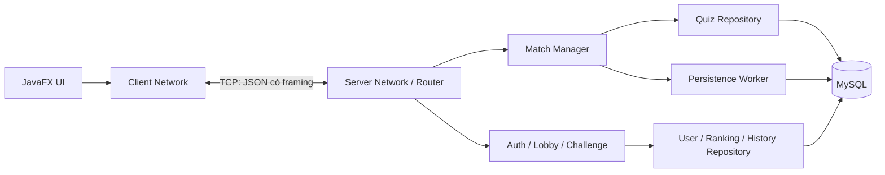
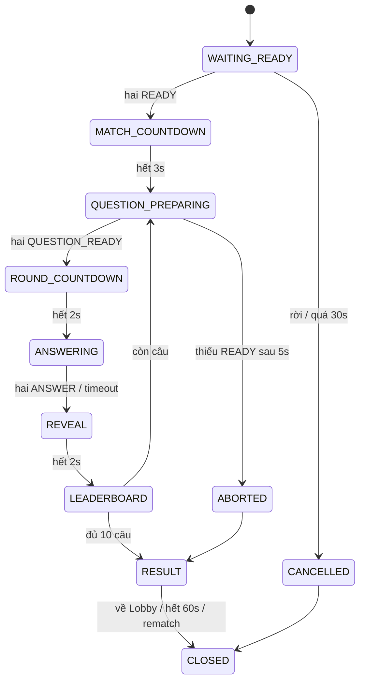

# SPEC — QUIZ ARENA: GAME QUIZ THI ĐẤU ĐỐI KHÁNG ONLINE

**Nhóm:** 7 — Môn Lập trình mạng  
**Phiên bản:** 1.0  
**Ngày:** 05/10/2026  
**Trạng thái:** Bản thiết kế đầy đủ để nhóm xem lại trước khi triển khai  
**Nền tảng:** Java 21 · JavaFX · TCP Socket · Multithreading · Jackson · JDBC · MySQL · Maven

## Mục lục

1. Cơ sở thiết kế và các quyết định mặc định
2. Mục tiêu, phạm vi và tiêu chí thành công
3. Người dùng và các luồng nghiệp vụ
4. Gameplay và luật thi đấu
5. Bảng xếp hạng trong trận và toàn hệ thống
6. Đặc tả giao diện JavaFX
7. Kiến trúc và ranh giới module
8. Mô hình trạng thái và xử lý đồng thời
9. Protocol TCP và hợp đồng message
10. Đồng bộ thời gian và tính công bằng
11. Dữ liệu, tài khoản và lưu kết quả
12. Xử lý lỗi, mất kết nối và phục hồi trạng thái
13. Yêu cầu phi chức năng và vận hành
14. Phân công và hợp đồng tích hợp
15. Kiểm thử và nghiệm thu
16. Mốc bàn giao và phạm vi mở rộng
17. Đối chiếu với tài liệu gốc và tài liệu tham khảo

---

## 1. Cơ sở thiết kế và các quyết định mặc định

### 1.1. Cơ sở

- Tài liệu gốc: [BTL_Quiz_Doi_Khang_Nhom7_KienTruc_ThietKe_PhanCong.md](../../../BTL_Quiz_Doi_Khang_Nhom7_KienTruc_ThietKe_PhanCong.md).
- Hướng đã thống nhất: ưu tiên trải nghiệm gameplay và giao diện tham khảo quiz.com, đồng thời bảo đảm nội dung Lập trình mạng.
- Yêu cầu bổ sung rõ ràng: có bảng xếp hạng trong trận cập nhật sau mỗi câu.
- Quan sát thực tế: chơi với người dùng trong phòng quiz.com 506880, quiz “Kiến thức chung #8”, đến khoảng câu 6 rồi dừng theo yêu cầu. Đã quan sát câu một lựa chọn, câu nhập số bằng thanh trượt, công bố đáp án, ảnh/lời giải và bảng xếp hạng. Chưa quan sát kết thúc toàn bộ quiz.
- Những mô tả về kiến trúc, protocol, cơ sở dữ liệu và màn kết quả dưới đây là thiết kế cho project; không phải kết luận về cách quiz.com triển khai bên trong.

### 1.2. Quyết định mặc định của bản spec

Các chi tiết chưa được người dùng chọn riêng được chốt bằng mặc định sau để nhóm có một hợp đồng triển khai thống nhất. Có thể sửa ở lần review spec, không cần tự suy diễn khi code.

| Mã | Quyết định |
| --- | --- |
| D01 | Luồng chính là chọn bộ quiz → thách đấu người online; chưa có phòng nhập PIN trong bản bắt buộc. |
| D02 | Mỗi trận đúng 10 câu, 15 giây trả lời mỗi câu, cùng câu hỏi và cùng thứ tự cho hai người. |
| D03 | Bộ câu được lấy ngẫu nhiên không lặp trong quiz đã chọn, gồm 4 Single Choice, 2 Multiple Choice, 2 True/False, 2 Short Answer, rồi xáo trộn thứ tự. |
| D04 | Giữ luật điểm 3/2/1/0 của tài liệu gốc; không cộng combo, không nhân đôi điểm. |
| D05 | Single Choice và True/False gửi ngay khi chọn; Multiple Choice và Short Answer có nút gửi. |
| D06 | Chuẩn bị câu trước khi mở timer; công bố đáp án 2 giây; bảng xếp hạng 3 giây. |
| D07 | Mỗi người tối đa một đáp án hợp lệ cho một lượt câu; không đổi sau khi server chấp nhận. |
| D08 | Bằng tổng điểm thì đồng hạng trong trận và hòa khi kết thúc; tốc độ đã được phản ánh trong điểm câu. |
| D09 | Thoát/mất kết nối sau khi countdown đầu trận bắt đầu được xử thua bỏ cuộc; trước countdown thì hủy trận, không cộng thống kê. |
| D10 | Không nối lại trận đang chạy sau disconnect. Người chơi có thể đăng nhập lại để vào Lobby và xem lịch sử đã lưu. |
| D11 | JSON UTF-8 với khung TCP có tiền tố độ dài 4 byte; mỗi kết nối có đúng một luồng ghi. |
| D12 | Mặc định phục vụ môi trường máy cá nhân/phòng lab/LAN; TCP bản đầu chưa có TLS và không được coi là sản phẩm sẵn sàng cho Internet công cộng. |
| D13 | Ảnh minh họa là tài nguyên đóng gói cùng bản phát hành; truyền assetId, không truyền ảnh base64 trong message. |
| D14 | Không làm UI biên soạn quiz, AI tạo quiz, đội chơi, bản đồ hoặc thanh trượt số trong phạm vi bắt buộc. |

## 2. Mục tiêu, phạm vi và tiêu chí thành công

### 2.1. Mục tiêu sản phẩm

Quiz Arena là ứng dụng desktop cho hai người thi đấu kiến thức trực tiếp. Trải nghiệm cần nhanh, dễ hiểu và làm rõ diễn biến: ai đã trả lời, đáp án đúng là gì, mỗi bên nhận bao nhiêu điểm và ai đang dẫn đầu.

Server là nguồn quyết định duy nhất đối với lời mời, trạng thái trận, hạn trả lời, chấm điểm, thứ hạng và kết quả. Client nhận dữ liệu, hiển thị và gửi thao tác.

### 2.2. Mục tiêu môn học

Phải trình bày và demo được:

1. Một TCP server duy trì kết nối lâu dài với nhiều client trên các tiến trình hoặc máy khác nhau.
2. Protocol có framing, request/response, sự kiện server push và mã lỗi rõ ràng.
3. Đọc/ghi socket không khóa JavaFX Application Thread.
4. Nhiều trận đồng thời, cô lập dữ liệu theo matchId.
5. Đồng bộ ANSWER, timeout, chat, exit và disconnect có kiểm soát.
6. Chấm điểm tại server, không tin thời gian/điểm/định danh do client tự khai báo.
7. Lưu kết quả, lịch sử và thống kê bằng transaction JDBC/MySQL.

### 2.3. Phạm vi bắt buộc

| Nhóm chức năng | Yêu cầu |
| --- | --- |
| Tài khoản | Register, Login, Logout, profile cơ bản, một phiên online cho mỗi tài khoản. |
| Lobby | Danh sách online, FREE/CHALLENGING/BUSY, chọn quiz, lọc theo chủ đề. |
| Thách đấu | Gửi, Accept, Reject, Cancel, hết hạn; xử lý tranh chấp đồng thời. |
| Phòng chờ | Hai người, quiz đã chọn, trạng thái Ready, countdown 3–2–1. |
| Thi đấu | 10 câu, 4 loại câu hỏi, timer 15 giây, xác nhận nhận đáp án. |
| Phản hồi | Đáp án đúng, lựa chọn hai bên, điểm câu, lời giải ngắn. |
| Xếp hạng trong trận | Tổng điểm, điểm mới cộng, đồng hạng, thay đổi thứ hạng sau mỗi câu. |
| Chat | Chỉ hai người trong trận, không thay đổi timer. |
| Kết quả | Win/Lose/Draw hoặc kết quả bỏ cuộc, xem lại câu đã chơi, Rematch/Lobby. |
| Dữ liệu | Ngân hàng quiz, lưu trận và đáp án, ranking toàn hệ thống, lịch sử cá nhân. |
| Độ ổn định | Disconnect, message sai, câu trả lời trùng/muộn, lỗi database và client chậm. |

### 2.4. Ngoài phạm vi bắt buộc

Ghép trận tự động, PIN/QR, spectator, nhiều hơn hai người một trận, team mode, tự tạo câu hỏi trên UI, AI, video/audio câu hỏi, numeric slider/map question, chat ngoài trận, reconnect tiếp tục trận, triển khai Internet công cộng và khôi phục trận sau khi server khởi động lại.

Nhạc nền, âm báo đúng/sai và confetti đơn giản được phép bổ sung khi chức năng bắt buộc đã nghiệm thu; không được làm phụ thuộc cho đồng bộ trận.

### 2.5. Tiêu chí thành công tổng quát

- Chạy được ít nhất 4 client với 2 trận đồng thời.
- Hai người nhận cùng trạng thái điểm/thứ hạng sau mỗi câu.
- Không lộ đáp án chuẩn khi câu còn mở.
- Mỗi trận bình thường có 10 lượt câu, 20 bản ghi kết quả trả lời và tổng điểm mỗi người từ 0 đến 30.
- Không có message/điểm/chat của trận A xuất hiện trong trận B.
- Server tiếp tục phục vụ người khác khi một client thoát, gửi sai dữ liệu hoặc chậm nhận.
- Tất cả chức năng có tiêu chí kiểm thử cụ thể ở mục 15.

## 3. Người dùng và các luồng nghiệp vụ

### 3.1. Vai trò

- **Người chơi:** đăng ký, đăng nhập, chọn quiz, mời đấu, chơi, chat, xem kết quả, ranking và lịch sử.
- **Người vận hành nhóm:** khởi chạy server, cấu hình MySQL, nạp ngân hàng câu hỏi bằng seed/import, theo dõi log. Không có admin UI trong bản bắt buộc.

### 3.2. Luồng đăng ký/đăng nhập

1. Client mở kết nối tới host/port cấu hình, hoàn tất HELLO.
2. Người dùng Register hoặc Login.
3. Server xác thực ngoài luồng xử lý trận và trả kết quả.
4. Login thành công gắn userId vào kết nối và trả profile.
5. Client mở Lobby, lấy danh sách quiz và nhận ONLINE_LIST.
6. Sai tài khoản/mật khẩu hiện lỗi chung; đăng nhập trùng tài khoản trả ALREADY_LOGGED_IN, không đẩy phiên cũ ra.

### 3.3. Luồng chọn quiz và thách đấu

1. Người chơi chọn một quiz AVAILABLE.
2. Chọn đối thủ FREE, gửi CHALLENGE với targetUserId và quizId.
3. Server kiểm tra hai người khác nhau, online, FREE và quiz đủ câu.
4. Server tạo challengeId, giữ chỗ cho cả hai và đẩy trạng thái CHALLENGING.
5. Người nhận thấy popup tên đối thủ, quiz, 10 câu, thời gian tối đa và hạn phản hồi 20 giây.
6. Accept hợp lệ tạo đúng một Match, đóng lời mời, chuyển hai bên BUSY và gửi MATCH_START.
7. Reject/Cancel/Expire trả hai bên về FREE và cập nhật Lobby.

Không được đổi quiz bên trong một lời mời đang chờ. Đổi quiz yêu cầu hủy lời mời cũ rồi gửi mới.

### 3.4. Luồng thi đấu

1. Match nạp và giữ snapshot 10 câu.
2. Hai client hiển thị phòng chờ và bấm Ready.
3. Hai Ready hợp lệ → countdown 3 giây do server điều khiển.
4. Mỗi câu: chuẩn bị dữ liệu → mở trả lời → nhận/chốt đáp án → công bố → xếp hạng.
5. Sau bảng xếp hạng câu 10, server gửi MATCH_RESULT và bắt đầu lưu kết quả.
6. Client hiển thị kết quả ngay, đồng thời hiện trạng thái lưu: đang lưu/đã lưu/chưa lưu được.

### 3.5. Luồng rematch

- Chỉ hai người của trận vừa kết thúc, còn online và chưa về Lobby, được gửi REMATCH_REQUEST.
- Lời đề nghị có hạn tối đa 20 giây, không vượt quá resultSessionExpiresAt của trận cũ. Người còn lại Accept/Reject.
- Nếu cả hai cùng bấm Tái đấu, REMATCH_REQUEST của người thứ hai được coi là đồng ý đề nghị đang PENDING của người thứ nhất. Người đề nghị lặp lại request chỉ nhận trạng thái hiện tại; không tạo đề nghị/trận thứ hai.
- Accept tạo matchId mới, cùng quiz, một bộ 10 câu mới lấy ngẫu nhiên; không bảo đảm không trùng câu của trận trước nếu ngân hàng nhỏ.
- Hai bên vào phòng chờ và Ready lại. Không tái sử dụng đáp án, điểm, timer hoặc phiên bản trạng thái của trận cũ.
- Lưu kết quả trận trước không bị hủy bởi rematch. Nếu database đang ở trạng thái lỗi đã xác nhận, rematch bị từ chối như một trận mới.
- Một người về Lobby, offline hoặc hết hạn đề nghị → rematch không còn hiệu lực.

## 4. Gameplay và luật thi đấu

### 4.1. Cấu trúc quiz và câu hỏi

Mỗi quiz có tên, chủ đề, mô tả ngắn, coverAssetId tùy chọn và tập câu hỏi đang hoạt động. Một câu thuộc một quiz trong v1. Một quiz AVAILABLE cần tối thiểu 4 Single Choice, 2 Multiple Choice, 2 True/False và 2 Short Answer hợp lệ.

Khi bắt đầu trận, server chọn theo tỷ lệ D03 rồi xáo trộn toàn bộ 10 câu. Danh sách không thay đổi giữa trận kể cả khi người vận hành sửa ngân hàng sau đó. Mỗi câu có roundId riêng ngoài questionId để nhận diện đúng lượt chơi.

### 4.2. Bốn dạng câu hỏi

| Loại | Dữ liệu đáp án client gửi | Thao tác UI | Quy tắc đúng |
| --- | --- | --- | --- |
| SINGLE_CHOICE | Một optionId dạng string | Bấm một thẻ đáp án là gửi | Bằng optionId chuẩn. |
| MULTIPLE_CHOICE | Mảng optionId không trùng | Chọn nhiều thẻ, bấm Gửi | Tập đã chọn bằng toàn bộ tập đáp án chuẩn. |
| TRUE_FALSE | Boolean | Bấm Đúng hoặc Sai là gửi | Boolean bằng đáp án chuẩn. |
| SHORT_ANSWER | String | Nhập rồi bấm Gửi/Enter | Chuẩn hóa rồi khớp một biến thể được chấp nhận. |

Single/Multiple Choice có 2–6 lựa chọn; ngân hàng demo chủ yếu dùng 4. OptionId ổn định, không dùng vị trí hoặc chữ hiển thị làm định danh.

Multiple Choice chọn rỗng và Short Answer chỉ có khoảng trắng không được gửi qua UI; server trả INVALID_ANSWER nếu nhận được. OptionId ngoài câu hiện tại, sai kiểu JSON hoặc đáp án quá dài không tiêu thụ quyền trả lời; một lựa chọn hợp lệ nhưng sai kiến thức vẫn là đáp án đã chốt và nhận 0 điểm.

Short Answer chuẩn hóa theo thứ tự: Unicode NFC → loại khoảng trắng đầu/cuối → gộp chuỗi khoảng trắng Unicode thành một dấu cách → lowercase với Locale.ROOT. Giữ dấu tiếng Việt và dấu câu; các cách viết được chấp nhận phải khai báo rõ trong acceptedAnswers. Không dùng fuzzy matching và không tự bỏ dấu.

### 4.3. Điểm và hạn trả lời

Elapsed được đo bằng đồng hồ monotonic của server, giữ độ chính xác nanosecond khi phân loại; answerTimeMs để lưu/hiển thị được lấy bằng phép làm tròn xuống.

| Điều kiện | Điểm |
| --- | ---: |
| Đúng, elapsed từ 0 đến 5.000 giây | 3 |
| Đúng, elapsed trên 5.000 đến 10.000 giây | 2 |
| Đúng, elapsed trên 10.000 đến 15.000 giây và câu còn OPEN | 1 |
| Sai hoặc không có đáp án được chấp nhận | 0 |

- Elapsed âm, sai trạng thái, sai lượt câu hoặc nhận sau deadline: không chấp nhận đáp án.
- Đúng tại mốc 5 giây nhận 3; đúng tại 10 giây nhận 2. Không phân loại bằng answerTimeMs đã làm tròn.
- Tại đúng deadline 15 giây, đáp án chỉ được nhận nếu câu còn OPEN và handler lấy quyền cập nhật trước thao tác đóng câu. Sau khi đóng, không mở lại. Quy tắc thứ tự tại biên này áp dụng thống nhất cho cả hai người.
- Server không lấy thời gian gửi từ client và không cộng bù độ trễ theo thông tin client khai báo.
- Tổng điểm trận là tổng điểm câu đã chốt, không có thưởng ngoài luật.
- Thanh thưởng trên UI có thể hiện “Đúng lúc này: +3/+2/+1”; đây là ước lượng hiển thị, kết quả server mới là quyết định cuối cùng.

### 4.4. Chuẩn bị và mở câu

1. Server chuyển sang QUESTION_PREPARING, gửi QUESTION với toàn bộ nội dung, lựa chọn, assetId và roundId, không kèm đáp án chuẩn.
2. Client tải tài nguyên local, render toàn bộ câu, khóa vùng trả lời, rồi gửi QUESTION_READY. Không dùng hiệu ứng gõ từng ký tự.
3. Server chờ đủ hai QUESTION_READY, tối đa 5 giây. Thiếu Ready làm abort trận vì CLIENT_NOT_READY; không tính thắng/thua hay điểm toàn hệ thống.
4. Đủ Ready → server gửi ROUND_COUNTDOWN 2 giây để hai bên thấy câu và chuẩn bị; hết countdown mới mở câu.
5. Khi mở, server ghi startNano, deadlineNano và phát QUESTION_OPEN với 15.000 ms còn lại.
6. Client mở controls khi nhận QUESTION_OPEN. Client không tự mở khi countdown của mình về 0.

Giai đoạn chuẩn bị giảm bất lợi do tải UI/ảnh, nhưng không đảm bảo hai máy hiển thị cùng một nanosecond. Xem giới hạn độ trễ tại mục 10.

### 4.5. Gửi và chốt đáp án

- Sau thao tác gửi, UI khóa ngay vùng đáp án, hiện “Đang gửi”.
- Server kiểm tra phiên đăng nhập, thành viên trận, roundId, questionId, trạng thái OPEN, deadline và kiểu đáp án.
- Chấp nhận → lưu đáp án và elapsed trong RAM, gửi ANSWER_ACK cho người gửi; gửi ANSWER_STATUS chỉ gồm userId/answered=true cho cả hai.
- Không gửi nội dung đáp án, đúng/sai hoặc điểm mới cho đối thủ trước khi đóng câu.
- Đủ hai đáp án được chấp nhận hoặc tới timeout → đóng câu đúng một lần.
- Sau khi đóng, mỗi người có AnswerOutcome: ANSWERED hoặc TIMEOUT. TIMEOUT có answer=null, answerTimeMs=null, correct=false, earnedPoints=0.
- Cả hai gửi sớm thì câu kết thúc sớm, không cần chờ hết 15 giây.

### 4.6. Công bố đáp án

Trong 2 giây, QUESTION_RESULT cung cấp cho cả hai:

- Đáp án chuẩn và lựa chọn của từng người.
- Outcome, đúng/sai, answerTimeMs và earnedPoints.
- Điểm trước câu, điểm sau câu và lời giải ngắn tùy chọn.
- Avatar từng người đặt dưới lựa chọn họ chọn. Multiple Choice có thể đặt avatar dưới từng lựa chọn; Short Answer hiển thị hai dòng trả lời riêng.
- Đáp án đúng có dấu tick; đáp án sai của mỗi người có dấu X; các lựa chọn khác giảm độ nổi bật.

Nếu không có explanation/ảnh, layout co lại, không để khung trống. Không tự yêu cầu đối thủ bấm tiếp tục.

### 4.7. Kết thúc và bỏ cuộc

- Sau 10 câu: tổng điểm lớn hơn thắng; bằng điểm hòa.
- Trong countdown đầu trận hoặc đang chơi, EXIT_MATCH/logout/disconnect của một người kết thúc bằng FORFEIT: người đó thua, người còn lại thắng dù tổng điểm thấp hơn.
- FORFEIT giữ điểm các câu đã chốt. Câu đang mở/chưa chốt không cộng điểm, outcome của đáp án đang chờ trong câu đó là ABANDONED; các câu chưa mở không tạo đáp án giả.
- Nếu cả hai đã được đánh dấu offline khi thao tác kết thúc xử lý, kết quả ABORTED, không có người thắng và không cập nhật thống kê thi đấu. Nếu FORFEIT đã chốt trước disconnect thứ hai, kết quả không thay đổi.
- Trận trước countdown đầu tiên là CANCELLED nếu người chơi rời; không lưu vào lịch sử thi đấu, chỉ ghi log.
- Lỗi server nội bộ hoặc CLIENT_NOT_READY sau khi đã bắt đầu là ABORTED: lưu lịch sử nếu có startedAt, không cộng thống kê.
- Kết quả bỏ cuộc phải ghi rõ lý do, không hiển thị như thắng thông thường bằng điểm.

## 5. Bảng xếp hạng trong trận và toàn hệ thống

### 5.1. Xếp hạng trong trận

Sau QUESTION_RESULT 2 giây, server phát ROUND_LEADERBOARD và giữ màn 3 giây. Message gồm đầy đủ hai hàng, không chỉ delta:

| Trường | Ý nghĩa |
| --- | --- |
| userId, displayName, avatarId | Người chơi. |
| rank | Hạng hiện tại, 1 hoặc 2; bằng điểm thì cả hai rank=1. |
| previousRank | Hạng trước câu; ở câu 1 cả hai bắt đầu rank=1. |
| scoreBefore, earnedPoints, totalScore | Dữ liệu để chạy animation cộng điểm. |
| correctCount | Số câu đúng đã chốt. |
| outcome | ANSWERED/TIMEOUT của câu vừa chốt. |

- Sắp xếp theo totalScore giảm dần. Bằng điểm giữ thứ tự player1/player2 để UI ổn định; thứ tự hàng không phải luật phá hòa.
- rankDelta = previousRank - rank chỉ dùng cho hiệu ứng ↑/↓; bằng điểm hiển thị “Đồng hạng”.
- UI chạy tăng điểm khoảng 500 ms, đổi vị trí hàng khoảng 400 ms; animation không điều khiển thời điểm mở câu sau.
- Luôn có tên, avatar, tổng điểm, điểm vừa cộng. Hàng của người đang dùng client có nhãn “Bạn”.
- Hàng câu đúng có màu mint, sai/timeout có màu san hô nhẹ, kèm icon/chữ để không phụ thuộc màu.
- Có thể hiện “Bạn vừa vượt lên” khi previousRank=2 và rank=1, không cần thêm luật điểm.
- Server gửi ROUND_LEADERBOARD sau cả câu 10 trước MATCH_RESULT.

Ảnh tham khảo từ phiên chơi: [xếp hạng sau câu 1](../../quiz-com-observations/leaderboard-after-question-1.jpg), [xếp hạng sau câu 2](../../quiz-com-observations/leaderboard-after-question-2.jpg).

### 5.2. Ranking toàn hệ thống

- Chỉ lấy dữ liệu đã COMMIT vào database.
- Sắp xếp: total_score DESC, wins DESC, user_id ASC. user_id chỉ để ổn định thứ tự.
- Cùng total_score và wins thì đồng hạng theo cách competition ranking: 1, 1, 3.
- Phân trang 20 người, tối đa 50 mỗi request; hiển thị bản đầu 20 người và vị trí cá nhân qua MY_RANK.
- COMPLETED và FORFEIT cập nhật total_matches, wins/losses/draws và cộng điểm thực sự đã chốt; không cộng thêm điểm vì thắng bỏ cuộc.
- ABORTED/CANCELLED không cộng thống kê.
- Sau lưu thành công, server phát RANKING_INVALIDATED cho người đang online; client đang mở Ranking tự tải lại, client khác chỉ đánh dấu dữ liệu cũ.
- Không cập nhật ranking toàn hệ thống theo từng câu chưa kết thúc trận.

## 6. Đặc tả giao diện JavaFX

### 6.1. Định hướng thị giác

Lấy cảm hứng từ quiz.com bằng nền có họa tiết nhẹ, màu pastel, viền đậm, avatar và phản hồi trực quan. Dùng tên/logo riêng của nhóm; ảnh/icon có nguồn phù hợp và ghi attribution khi cần.

| Token | Giá trị thiết kế mặc định |
| --- | --- |
| Nền Lobby | Kem #FFF9EF |
| Nền trận | Xanh đậm #234349 |
| Chữ chính trên nền sáng | #17282C |
| Chữ trên nền trận | #FFF9EF |
| Mint | #C5F6DF |
| Lime | #D3EA93 |
| Peach | #F7CC8D |
| Coral | #EFA4A2 |
| Hành động chính | #4FA477 |
| Viền | #15292E, 2–3 px |
| Bo góc | Thẻ 16 px, nút 24 px |
| Khoảng cách | Bội số 8 px |

- Cửa sổ mặc định 1280×800, tối thiểu 1024×720; hỗ trợ resize và DPI hệ điều hành.
- Không giả định game full screen. Ở chiều rộng nhỏ, chat thành drawer để giữ câu hỏi đủ chỗ.
- Cỡ chữ body 16 px; đáp án 18–22 px; tiêu đề câu 26–32 px; số điểm 24–32 px.
- Chữ có dấu tiếng Việt đầy đủ; font fallback khi thiếu font đóng gói.
- Trạng thái focus, hover, selected, disabled, pending và correct/incorrect phải phân biệt.
- Ảnh giữ tỷ lệ, tối đa khoảng 35% vùng câu hỏi; câu dài cho wrap/scroll trong vùng riêng.
- Câu hỏi tối đa 500 ký tự, lựa chọn 120 ký tự, lời giải 500 ký tự. UI không cắt mất thông tin cần trả lời.
- Animation phải có thể giảm/tắt bằng lựa chọn local “Giảm chuyển động”; countdown và nghiệp vụ vẫn hoạt động.

### 6.2. Login/Register

- Logo/tên ứng dụng; form username/password; đổi giữa đăng nhập và đăng ký.
- Cấu hình host/port trong phần kết nối, mặc định localhost:5555.
- Hiển thị rõ: đang kết nối, không kết nối được, đang xác thực, lỗi xác thực.
- Trong khi gửi chỉ disable nút submit liên quan; vẫn cho đóng cửa sổ và chỉnh host sau thất bại.
- Register có confirmPassword chỉ kiểm tra local; không gửi confirmPassword lên server.
- Không tự lưu mật khẩu xuống file.

### 6.3. Lobby và thư viện quiz

- Header: avatar/tên, tổng điểm, nút Ranking, Lịch sử, Đăng xuất.
- Hàng chủ đề: “Tất cả”, “Kiến thức chung”, “Khoa học”, “Lịch sử”, “Công nghệ” theo dữ liệu server.
- Grid quiz card: cover/placeholder, tên, chủ đề, mô tả ngắn, “10 câu/trận”, trạng thái AVAILABLE/UNAVAILABLE.
- Panel online: tên, điểm, FREE/CHALLENGING/BUSY; không hiển thị user đang dùng là đối thủ.
- Chọn quiz trước rồi chọn người; nút Thách đấu disable khi chưa chọn quiz hoặc đối thủ không FREE.
- ONLINE_LIST là snapshot có revision; chỉ áp dụng revision mới hơn.
- Danh sách rỗng có thông báo “Chưa có đối thủ online”, không phải lỗi.

### 6.4. Chi tiết quiz và popup challenge

- Chi tiết: tên, mô tả, cover, tỷ lệ 4 loại câu, luật 15 giây và 3/2/1 điểm.
- Không có nút xem đáp án hoặc xem trước bộ câu sẽ thi đấu.
- Popup nhận lời mời không đóng băng socket receiver; Accept/Reject, countdown phản hồi 20 giây.
- Popup người gửi có trạng thái chờ và nút Hủy.
- Accept gửi đi thì hiện pending cho đến MATCH_START/CHALLENGE_CLOSED; không tự chuyển vào trận trước xác nhận.

### 6.5. Phòng chờ và countdown

- Hai avatar đối diện, tên quiz, tóm tắt luật, hai trạng thái Ready.
- Nút Sẵn sàng một lần; sau ACK hiện “Bạn đã sẵn sàng”.
- Thời hạn Ready 30 giây tính từ MATCH_START; hết hạn hủy trước khi bắt đầu.
- Người chơi được rời phòng chờ; người còn lại nhận lý do và về Lobby.
- Countdown đầu trận 3–2–1, controls trả lời chưa có hiệu lực.

### 6.6. Màn thi đấu

- Header luôn có hai tên/avatar, điểm của các câu đã chốt, câu x/10.
- Thanh thời gian hiển thị giây còn lại; có thể kèm mức thưởng +3/+2/+1.
- Vùng câu hỏi dùng renderer theo questionType.
- Single Choice: các thẻ lớn, label optionId A/B/C/D nếu phù hợp; bấm là gửi.
- Multiple Choice: tick rõ, hiển thị “Chọn tất cả đáp án đúng”, nút Gửi enable khi chọn ít nhất một.
- True/False: hai thẻ Đúng/Sai, bấm là gửi.
- Short Answer: text field, giới hạn 120 ký tự, Gửi/Enter; không Enter gửi chat khi focus ở câu trả lời.
- Phím A/B/C/D chỉ áp dụng câu một lựa chọn khi focus không ở input/chat; Space toggle thẻ đang focus với nhiều lựa chọn.
- Không có thao tác pause hoặc skip của người chơi trong trận 1v1.
- Trạng thái sau gửi: Đang gửi → Đã nhận đáp án → Chờ đối thủ; không nhận ACK sau 2 giây thì hiện “Đang chờ xác nhận”, không mở lại controls và không tự gửi lại.
- Nếu server trả lỗi đáp án có thể sửa và câu vẫn OPEN, mở lại vùng trả lời; nếu CLOSED/LATE thì chờ kết quả.

### 6.7. Công bố đáp án và xếp hạng

- REVEAL giữ nguyên câu và các lựa chọn, bổ sung dấu đúng/sai và lựa chọn hai người.
- Avatar trên lựa chọn chỉ xuất hiện khi đã chốt câu.
- Explanation/ảnh tùy chọn không làm thay đổi thời gian server.
- LEADERBOARD thay vùng câu bằng hai hàng xếp hạng; header và chat vẫn hoạt động.
- Từ kết quả câu tới leaderboard không cần click. UI không tự cộng điểm khi nhận lại cùng eventSeq.
- Khi event mới tới, kết thúc animation cũ tại giá trị cuối rồi render event mới; không để animation chặn QUESTION_OPEN.

### 6.8. Chat

- Panel rộng khoảng 260 px hoặc drawer; thông báo chưa đọc khi thu gọn.
- Nội dung plain text, 1–300 ký tự sau strip; không HTML, không ảnh, không link preview.
- Enter gửi khi focus chat; Shift+Enter xuống dòng nếu dùng TextArea.
- Hiện tên người gửi, thời gian, trạng thái chờ/đã gửi/thất bại.
- Server tạo chatMessageId và echo message đã chấp nhận cho cả hai; không thêm bản sao optimistic nếu đã có cùng requestId.
- Giới hạn 5 message/10 giây mỗi người; RATE_LIMITED chỉ ảnh hưởng chat.
- Chat khả dụng từ WAITING_READY đến RESULT trong cùng trận; kết thúc RESULT session thì không relay nữa.

### 6.9. Kết quả, xem lại, ranking và history

- Kết quả: thắng/thua/hòa, hai tổng điểm, số câu đúng; bỏ cuộc hiện lý do riêng.
- Bảng xem lại từng câu: loại câu, nội dung, lựa chọn hai bên, đáp án, thời gian, điểm, lời giải.
- Trận FORFEIT/ABORTED chỉ xem các câu đã mở; không mô tả câu chưa chơi là trả lời sai.
- Nút Tái đấu, Về Lobby; trạng thái lưu kết quả riêng, không thông báo “đã lưu” trước ACK lưu.
- Result session tối đa 60 giây tính từ MATCH_RESULT; hết hạn server giải phóng hai người về FREE. UI có thể giữ bản kết quả để đọc, nhưng nút rematch bị disable và chat kết thúc.
- Ranking hiển thị rank, tên, tổng điểm, số thắng, vị trí cá nhân; có phân trang và loading/error.
- History có đối thủ, thời gian, điểm, kết quả, lý do kết thúc; chỉ được mở chi tiết trận người dùng đã tham gia.

## 7. Kiến trúc và ranh giới module

### 7.1. Kiến trúc tổng thể



### 7.2. Tổ chức Maven

| Module | Trách nhiệm | Không chứa |
| --- | --- | --- |
| common | Message envelope, enums, public DTO, validation giới hạn, fixture protocol | JavaFX, JDBC, đáp án private của ngân hàng. |
| server | Network, session, challenge, match, evaluator, repository, persistence | Scene/FXML hoặc logic hiển thị. |
| client | Socket client, reducer trạng thái, JavaFX views/renderers/assets | Chấm đáp án, mật khẩu hash database, kết nối MySQL. |

Các DTO public và model private tách riêng. Không serialize trực tiếp QuestionEntity vì entity có correctAnswer/acceptedAnswers.

### 7.3. Hợp đồng module

| Module | Đầu vào | Đầu ra | Phụ thuộc |
| --- | --- | --- | --- |
| FrameCodec | Byte stream | JSON frame hoàn chỉnh hoặc framing error | Stream TCP. |
| ConnectionManager | Connect/disconnect, outbound event | Session registry, enqueue gửi | ClientHandler/Writer. |
| MessageRouter | Message đã parse và authenticated session | Command hợp lệ tới module, ERROR | Auth/Challenge/Match/query service. |
| AuthService | Username/password | Profile hoặc lỗi | UserRepository, PasswordHasher. |
| ChallengeManager | Invite/response/cancel | Challenge state, tạo trận đúng một lần | Online registry, MatchManager. |
| MatchManager | Ready/answer/chat/exit/timer | State transition, event public, immutable result | QuestionRepository, evaluator, clock, scheduler, transport. |
| AnswerEvaluator | Private question + typed answer | Correct boolean | Không socket, không database. |
| ScoreCalculator | Correct + elapsedNano | 0/1/2/3 | Không UI hoặc wall clock. |
| PersistenceService | Immutable MatchSummary | Pending/Saved/Failed | MatchRepository, transaction JDBC. |
| ClientStateReducer | Server event có eventSeq/revision | State hiển thị mới | Không chấm điểm. |
| QuestionRenderer | Public question + trạng thái controls | View và typed ANSWER intent | JavaFX; không gọi Socket trực tiếp. |

Transport của MatchManager chỉ enqueue message, không thực hiện blocking socket write dưới khóa trận. Repository trả immutable snapshot, không giữ JDBC Connection cho suốt trận.

## 8. Mô hình trạng thái và xử lý đồng thời

### 8.1. Trạng thái người chơi

| Trạng thái | Ý nghĩa |
| --- | --- |
| OFFLINE | Không có authenticated connection. |
| FREE | Có thể nhận/gửi challenge. |
| CHALLENGING | Đang có một lời mời giữ chỗ. |
| BUSY | Đã thuộc một Match, bao gồm phòng chờ và result session. |

Một tài khoản chỉ có một authenticated connection và tối đa một challenge/match đang giữ chỗ. Người ở Ranking/History vẫn FREE trừ khi có lời mời/trận.

### 8.2. Trạng thái lời mời

PENDING → REJECTED / CANCELLED / EXPIRED / INVALIDATED, hoặc PENDING → CREATING_MATCH → ACCEPTED / INVALIDATED.

Mỗi transition terminal chỉ xảy ra một lần. ChallengeManager dùng một khóa ngắn chung cho các mutation challenge và reserve hai user; không query database hoặc gửi socket blocking dưới khóa này. Các lời mời ngược chiều/đến cùng user được tuần tự hóa, không có hai trận giữ cùng người.

Accept dùng compare-and-transition PENDING → CREATING_MATCH khi cả hai reservation còn thuộc challengeId. Nạp snapshot câu ở service executor ngoài khóa. Sau khi nạp, lấy khóa lại, kiểm tra lời mời còn CREATING_MATCH, hai connection còn hợp lệ và reservation còn nguyên, rồi mới đăng ký Match và chuyển ACCEPTED. Nếu nạp/tạo match thất bại hoặc quá 5 giây, chuyển INVALIDATED và hoàn tác reservation. Callback nạp xong sau khi INVALIDATED phải no-op.

Trong CREATING_MATCH, response Accept/Cancel khác trả INVALID_STATE; disconnect vẫn INVALIDATED lời mời. UI hiển thị “Đang chuẩn bị trận”. CHALLENGE_CLOSED chỉ phát cho trạng thái terminal, không phát ACCEPTED rồi mới hoàn tác thành trạng thái terminal khác.

Timer hết hạn challenge chỉ áp dụng khi còn PENDING; CREATING_MATCH dùng timeout nạp riêng 5 giây. Khi đồng ý rematch, coordinator cũng nạp câu ngoài khóa rồi chuyển assignment từ matchId cũ sang mới nếu cả hai vẫn online/gắn vào trận cũ và result session chưa hết hạn. Không tạm chuyển hai người về FREE giữa bước rematch, tránh challenge bên ngoài chen vào.

### 8.3. State machine trận



Từ MATCH_COUNTDOWN, QUESTION_PREPARING, ROUND_COUNTDOWN, ANSWERING, REVEAL hoặc LEADERBOARD có thể kết thúc sớm vào RESULT với finishReason=FORFEIT/ABORTED. Khi đó hủy timer của phase hiện tại. PersistenceStatus độc lập với gameplay state.

### 8.4. State tối thiểu của Match

matchId, quizSnapshot, player1/player2, phase, phaseVersion, eventSeq, roundIndex, roundId, questionSnapshots, ready flags, acceptedAnswers, questionClosed, score/correctCount mỗi người, previousRanks, phaseStart/deadline monotonic, startedAt/endedAt UTC, finishReason/reasonCode, resultSessionExpiresAt và persistenceStatus. startedAt được đặt khi bước vào MATCH_COUNTDOWN đầu trận; WAITING_READY chưa có startedAt.

### 8.5. Quy tắc đồng thời

- Mỗi Match có một khóa riêng. Mọi mutation Ready/Answer/phase timeout/exit/rematch attachment đều được kiểm tra và cập nhật dưới khóa đó.
- Handler ANSWER lấy timestamp monotonic tại lúc bắt đầu kiểm tra dưới khóa Match; đây là thời điểm server tiếp nhận nghiệp vụ, không phải thời gian client bấm.
- Timer callback mang matchId, roundId, expectedPhase và expectedPhaseVersion. Callback cũ không trùng trạng thái hiện tại phải no-op.
- Đóng câu và kết thúc trận là thao tác idempotent: kiểm tra cờ, cập nhật state, tạo immutable events/summary, không chấm hoặc lưu hai lần.
- Sự kiện được gán eventSeq và enqueue theo thứ tự ngay trong vùng khóa, nhưng enqueue phải non-blocking. Writer thread thực hiện I/O sau đó.
- Nếu enqueue thất bại vì queue đầy/connection đóng, chỉ ghi nhận connection lỗi rồi thực hiện close/cleanup ngoài vùng khóa; không gọi ngược ConnectionManager/MatchManager đồng bộ trong thao tác enqueue.
- DB/auth chạy executor riêng; scheduler không chạy JDBC hoặc bcrypt/PBKDF2. Không gọi sleep trong ClientHandler/Match để chờ 15 giây.
- Chat vào cùng Match lock để xác thực membership và gán eventSeq nhanh; không thay đổi round start/deadline.
- Không giữ khóa ConnectionManager khi gọi MatchManager. Disconnect cập nhật registry trước, rồi enqueue thông báo match. Tránh khóa lồng nhau theo hướng ngược.
- Không giữ khóa Match khi lấy khóa challenge/assignment registry. Rematch ghi nhận đồng ý dưới khóa Match, sau đó coordinator thực hiện bước chuyển assignment riêng với guard matchId/generation; callback vào trận cũ/mới sau khi nhả khóa registry.

### 8.6. Kết nối và các luồng

- Một accept loop, tối đa 32 socket đang mở trong bản lab.
- Mỗi socket có một reader task và một writer task trong các executor chuyên trách đủ phục vụ 32 kết nối; không tạo thêm task vô hạn theo mỗi message.
- Outbound queue tối đa 256 frame/connection; không dùng put blocking dưới khóa Match. Queue đầy → đóng connection chậm, áp dụng disconnect cho đúng trận, không làm kẹt người khác.
- Scheduler pool mặc định 2 threads, service/DB executor mặc định 4 threads với queue hữu hạn 128 yêu cầu. Queue đầy → SERVER_BUSY; không chặn scheduler.
- Client có một reader và một writer nền. Tất cả UI mutation qua Platform.runLater; không chạy JDBC hoặc socket read/write trên JavaFX Application Thread.
- Shutdown hủy scheduler/tasks, đóng socket, giải phóng JDBC resources. Không để một user tồn tại online sau khi connection đã được cleanup.

## 9. Protocol TCP và hợp đồng message

### 9.1. Framing và serialization

Mỗi frame: **4 byte độ dài N theo big-endian → N byte JSON UTF-8**. N chỉ đếm byte JSON, không gồm prefix. N hợp lệ từ 1 đến 65.536 byte.

- Reader phải tích lũy đủ cả prefix và body; không coi một lần read() là một message.
- Socket read timeout trong lúc nhận frame phải giữ buffer/số byte đã đọc và tiếp tục phần còn thiếu, không quay lại đọc prefix mới. Frame chưa hoàn tất quá 10 giây từ byte đầu tiên bị đóng vì INCOMPLETE_FRAME; áp dụng cả client và server.
- Phải đọc được nhiều frame trong cùng một lần nhận và một frame bị chia thành nhiều lần nhận.
- Prefix không hợp lệ hoặc EOF giữa frame: đóng kết nối và cleanup. Body JSON lỗi nhưng framing vẫn đúng: trả ERROR BAD_JSON, có thể tiếp tục với frame kế tiếp.
- Không dùng Java ObjectInputStream/ObjectOutputStream hoặc serialization class tùy ý.
- Jackson chỉ parse envelope/DTO được chỉ định; không bật default polymorphic typing theo tên class từ client.
- Writer ghi prefix và body của từng frame như một đơn vị, theo thứ tự outbound queue. Không có hai thread cùng ghi một Socket OutputStream.
- JSON pretty-print trong spec để dễ đọc; trên wire có thể serialize compact.
- Unknown envelope field bị từ chối INVALID_MESSAGE; type không biết trả UNKNOWN_TYPE. Optional payload fields được phép thiếu theo từng contract; field không có trong contract bị từ chối để phát hiện lệch tích hợp sớm.

### 9.2. Envelope v1

```json
{
  "protocolVersion": 1,
  "type": "ANSWER",
  "requestId": "request-uuid",
  "matchId": "match-uuid",
  "roundId": "round-uuid",
  "eventSeq": null,
  "payload": {
    "questionId": 101,
    "answer": "A"
  }
}
```

| Field | Hợp đồng |
| --- | --- |
| protocolVersion | Integer, luôn 1. Khác 1 → UNSUPPORTED_PROTOCOL, đóng kết nối sau phản hồi. |
| type | Enum message trong bảng dưới. |
| requestId | UUID cho mọi client request; response trực tiếp echo cùng ID; server event tự phát dùng null. |
| matchId | UUID cho request/event thuộc trận; null ở auth/lobby/challenge/ranking. |
| roundId | UUID cho event/request thuộc một lượt câu; null cho event toàn trận. |
| eventSeq | Server event thuộc trận có số tăng dần; client luôn null. Không được dùng giá trị client gửi làm thứ tự server. |
| payload | Object có schema theo type, không nhận null. |

Các ID dạng `request-uuid` trong ví dụ là ký hiệu minh họa; dữ liệu thật phải là UUID hợp lệ. questionId/userId/quizId là integer dương trong phạm vi long.

Không có userId người gửi ở envelope. Server suy ra từ authenticated session. Nếu payload cần targetUserId thì đó là người nhận, không phải định danh có thể tự nhận cho người gửi.

### 9.3. Catalogue message

Ký hiệu C→S: client gửi; S→C: server trả; S→2C: broadcast trong đúng trận.

| Type | Chiều | Payload bắt buộc / hành vi |
| --- | --- | --- |
| HELLO | C→S | clientVersion string, assetPackVersion string; request đầu tiên sau connect. |
| HELLO_ACK | S→C | connectionId, protocolVersion, serverTimeMs, heartbeatIntervalMs=10000, assetPackVersion. |
| PING | C→S | clientTimeMs; mỗi 10 giây khi kết nối còn mở. |
| PONG | S→C | echo clientTimeMs, serverTimeMs; không ảnh hưởng điểm. |
| REGISTER | C→S | username, password, displayName, avatarId. |
| REGISTER_RESULT | S→C | userId, username; đăng ký không tự tạo phiên Login. |
| LOGIN | C→S | username, password. |
| LOGIN_RESULT | S→C | profile: userId, username, displayName, avatarId, totalScore, totalMatches, wins, losses, draws. |
| LOGOUT | C→S | Object rỗng; trong trận áp dụng luật rời trận trước khi tháo phiên. |
| LOGOUT_ACK | S→C | Object rỗng; client đóng socket sau nhận hoặc timeout 2 giây. |
| ONLINE_LIST_REQUEST | C→S | Object rỗng, dùng tải ban đầu/resync. |
| ONLINE_LIST | S→C | revision, users[] gồm userId/displayName/avatarId/totalScore/status. |
| QUIZ_LIST_REQUEST | C→S | categoryId nullable, page>=1, pageSize 1–50. |
| QUIZ_LIST | S→C | page/pageSize/totalItems, categories[], items[] QuizSummary. |
| QUIZ_DETAIL_REQUEST | C→S | quizId. |
| QUIZ_DETAIL | S→C | QuizSummary, description, typeCounts, rules; không có đáp án/câu đã chọn cho trận. |
| CHALLENGE | C→S | targetUserId, quizId. |
| CHALLENGE_ACK | S→C | challengeId, targetUserId, QuizSummary, expiresAtMs. |
| CHALLENGE_RECEIVED | S→C | challengeId, challengerProfile, QuizSummary, expiresAtMs. |
| CHALLENGE_ACCEPT / CHALLENGE_REJECT / CHALLENGE_CANCEL | C→S | challengeId; validate actor đúng vai trò. |
| CHALLENGE_CLOSED | S→C | challengeId, status, reason, matchId nullable; gửi cho hai bên. |
| MATCH_START | S→2C | QuizSummary, players[], totalRounds=10, readyDeadlineAtMs; state WAITING_READY. |
| MATCH_READY | C→S | Object rỗng, matchId ở envelope. |
| READY_STATUS | S→2C | readyUserIds[], phase; response của người gửi echo requestId. |
| MATCH_COUNTDOWN | S→2C | durationMs=3000, phaseEndsAtMs, serverTimeMs. |
| QUESTION | S→2C | PublicQuestion, roundIndex 1–10, totalRounds, readyDeadlineAtMs; controls khóa. |
| QUESTION_READY | C→S | questionId; matchId/roundId ở envelope. |
| ROUND_COUNTDOWN | S→2C | durationMs=2000, phaseEndsAtMs, serverTimeMs; xác nhận đã có hai Ready. |
| QUESTION_OPEN | S→2C | questionId, remainingMs=15000, deadlineAtMs, serverTimeMs. |
| ANSWER | C→S | questionId, answer theo kiểu questionType. |
| ANSWER_ACK | S→C | questionId, accepted=true, answerTimeMs, acceptedRequestId; không có đúng/sai/điểm. |
| ANSWER_STATUS | S→2C | userId, answered=true; không có answer. |
| QUESTION_RESULT | S→2C | questionId, correctAnswer, explanation nullable, explanationAssetId nullable, outcomes[], durationMs=2000, phaseEndsAtMs, serverTimeMs. |
| ROUND_LEADERBOARD | S→2C | roundIndex, standings[], durationMs=3000, phaseEndsAtMs, serverTimeMs. |
| CHAT | C→S | text; không nhận senderId từ client. |
| CHAT_MESSAGE | S→2C | chatMessageId, senderUserId, displayName, text, sentAtMs; echo requestId của CHAT. |
| MATCH_RESULT | S→2C | finishReason, reasonCode, winnerUserId nullable, players[], completedRounds, openedRounds, review[], persistenceStatus=PENDING, resultExpiresAtMs. |
| MATCH_SAVE_STATUS | S→C | status=PENDING/SAVED/FAILED, retryable, savedAtMs nullable; gửi cho hai người còn kết nối dù đã chuyển trận. |
| REMATCH_REQUEST | C→S | Object rỗng; matchId là trận cũ. |
| REMATCH_RESPONSE | C→S | accept boolean; matchId là trận cũ. |
| REMATCH_STATUS | S→2C | status=PENDING/ACCEPTED/REJECTED/EXPIRED/INVALIDATED, requesterUserId, expiresAtMs nullable, newMatchId nullable. |
| EXIT_MATCH | C→S | Object rỗng; server quyết định reason theo phase. |
| EXIT_ACK | S→C | reason, lobbyStatus=FREE. |
| RESULT_SESSION_CLOSED | S→C | reason=EXITED/EXPIRED/REMATCH; kết thúc chat/rematch của trận cũ. |
| MATCH_SNAPSHOT_REQUEST | C→S | Object rỗng, chỉ thành viên result session/trận hiện tại. |
| MATCH_SNAPSHOT | S→C | phase, phaseVersion, serverTimeMs, phaseRemainingMs, QuizSummary, players[], round data được phép theo phase, acceptedAnswer của chính mình nullable, answeredUserIds[], latestResult/standings nullable. |
| RANKING_REQUEST | C→S | page>=1, pageSize 1–50. |
| RANKING | S→C | page/pageSize/totalItems, entries[], myRank với cùng tiêu chí xếp hạng. |
| RANKING_INVALIDATED | S→C | revision tăng sau commit, reason=MATCH_SAVED. |
| PROFILE_REQUEST | C→S | Object rỗng; chỉ lấy profile chính mình. |
| PROFILE | S→C | Profile mới từ dữ liệu đã lưu. |
| HISTORY_REQUEST | C→S | page>=1, pageSize 1–50; chỉ lịch sử chính mình. |
| HISTORY | S→C | page/pageSize/totalItems, MatchHistorySummary[]. |
| MATCH_DETAIL_REQUEST | C→S | historyMatchId; không dùng matchId envelope để tránh nhầm với trận live. |
| MATCH_DETAIL | S→C | Summary + review[] của trận đã lưu mà người gửi tham gia. |
| ERROR | S→C | code, message, retryable, details object; echo requestId nếu parse được. |

QuizSummary: quizId, title, categoryId, categoryName, coverAssetId nullable, availability, totalRounds=10. PublicQuestion: questionId, questionType, content, options[] gồm id/text (rỗng cho TRUE_FALSE/SHORT_ANSWER), questionAssetId nullable, timeLimitMs=15000. Các trường explanation/correctAnswer/acceptedAnswers chỉ có trong model private hoặc event công bố/kết quả.

Request thông thường có response thành công hoặc ERROR để giải quyết pending. QUESTION_READY là tín hiệu đã render: client không giữ pending request cần ACK cho riêng một người; ROUND_COUNTDOWN xác nhận đủ hai bên và timeout kết thúc nếu thiếu. READY_STATUS xác nhận MATCH_READY. Duplicate QUESTION_READY trước countdown không làm reset hạn. CHALLENGE_ACCEPT có thể chờ tối đa 5 giây trước CHALLENGE_CLOSED/MATCH_START hoặc ERROR.

### 9.3.1. DTO kết quả, xem lại và lý do kết thúc

| DTO/field | Cấu trúc |
| --- | --- |
| PlayerMatchSummary | userId, displayName, avatarId, totalScore, correctCount, rank theo tổng điểm; kết quả thắng riêng qua winnerUserId, không thay rank điểm khi bỏ cuộc. |
| AnswerOutcome | userId, answer typed/null, outcome, correct boolean/null, answerTimeMs nullable, earnedPoints, scoreBefore, totalScore. |
| QuestionReview | roundId, roundIndex, PublicQuestion, correctAnswer, explanation nullable, explanationAssetId nullable, outcomes[2], revealed boolean. |
| MatchHistorySummary | matchId, quizId/title snapshot, opponentUserId/name snapshot, ownScore, opponentScore, outcome từ góc nhìn người dùng, finishReason, reasonCode, startedAtMs, endedAtMs. |
| RankingEntry | rank, userId, displayName, avatarId, totalScore, wins, totalMatches. |
| Category | categoryId, categoryName, displayOrder. |

correctAnswer của Single Choice là optionId; Multiple Choice là array optionId; True/False là boolean; Short Answer là biến thể đầu tiên trong acceptedAnswers gốc để hiển thị, không phải tự lower-case phần hiển thị. answer trong outcomes giữ dữ liệu người chơi đã gửi; chuẩn hóa chỉ dùng để chấm.

completedRounds là số câu đã có QUESTION_RESULT; openedRounds là số câu đã phát QUESTION, bao gồm câu đang chuẩn bị chưa mở timer. review chỉ gồm các câu đó. Câu hiện tại chưa chốt ở trận kết thúc sớm có hai outcome ABANDONED và revealed=false; client ghi “Câu chưa được chấm”, không hiển thị như TIMEOUT hoặc sai. Đáp án chuẩn được phép xem sau khi trận đã kết thúc.

reasonCode nhận một trong NORMAL, USER_EXIT, LOGOUT, DISCONNECT, BOTH_DISCONNECTED, CLIENT_NOT_READY, INTERNAL_ERROR, SERVER_SHUTDOWN. finishReason là loại kết thúc COMPLETED/FORFEIT/ABORTED; reasonCode nêu nguyên nhân cụ thể. MATCHES lưu cả hai field. CANCELLED trước startedAt dùng event/log với cùng reasonCode phù hợp, không tạo MatchHistorySummary.

### 9.4. Ví dụ kết quả câu và bảng xếp hạng

```json
{
  "protocolVersion": 1,
  "type": "QUESTION_RESULT",
  "requestId": null,
  "matchId": "match-uuid",
  "roundId": "round-uuid",
  "eventSeq": 18,
  "payload": {
    "questionId": 101,
    "correctAnswer": "A",
    "explanation": "Lời giải ngắn cho câu hỏi.",
    "explanationAssetId": null,
    "outcomes": [
      {
        "userId": 7,
        "answer": "A",
        "outcome": "ANSWERED",
        "correct": true,
        "answerTimeMs": 3200,
        "earnedPoints": 3,
        "scoreBefore": 6,
        "totalScore": 9
      },
      {
        "userId": 8,
        "answer": "C",
        "outcome": "ANSWERED",
        "correct": false,
        "answerTimeMs": 4100,
        "earnedPoints": 0,
        "scoreBefore": 6,
        "totalScore": 6
      }
    ],
    "durationMs": 2000,
    "phaseEndsAtMs": 1791170002000,
    "serverTimeMs": 1791170000000
  }
}
```

```json
{
  "protocolVersion": 1,
  "type": "ROUND_LEADERBOARD",
  "requestId": null,
  "matchId": "match-uuid",
  "roundId": "round-uuid",
  "eventSeq": 19,
  "payload": {
    "roundIndex": 3,
    "standings": [
      {
        "userId": 7,
        "displayName": "Minh",
        "avatarId": "avatar-01",
        "rank": 1,
        "previousRank": 1,
        "scoreBefore": 6,
        "earnedPoints": 3,
        "totalScore": 9,
        "correctCount": 3,
        "outcome": "ANSWERED"
      },
      {
        "userId": 8,
        "displayName": "Phúc",
        "avatarId": "avatar-02",
        "rank": 2,
        "previousRank": 1,
        "scoreBefore": 6,
        "earnedPoints": 0,
        "totalScore": 6,
        "correctCount": 2,
        "outcome": "ANSWERED"
      }
    ],
    "durationMs": 3000,
    "phaseEndsAtMs": 1791170005000,
    "serverTimeMs": 1791170002000
  }
}
```

### 9.5. Phân quyền, thứ tự và idempotency

- Chưa HELLO chỉ được gửi HELLO; chưa Login chỉ được REGISTER/LOGIN/PING/LOGOUT. Request quiz, online, ranking và history yêu cầu đăng nhập.
- HELLO có hạn 5 giây từ connect; assetPackVersion không khớp trả ASSET_PACK_MISMATCH, không cho vào trận để tránh thiếu tài nguyên.
- Server chỉ cho thành viên thật gửi message tới match; không nhận matchId của trận khác, kể cả user đang online.
- CHALLENGE_ACCEPT/REJECT chỉ từ người nhận; CANCEL chỉ từ người gửi.
- Cùng requestId và cùng nội dung request đã hoàn tất trong cache thì trả response cũ, không lặp side effect. Cache tối đa 100 response/connection trong 60 giây; không cache mật khẩu hoặc request auth thô.
- Cùng requestId nhưng nội dung khác trả REQUEST_ID_REUSED. Ngoài cache, semantic guard trên challengeId/matchId/roundId vẫn ngăn tạo trận hoặc cộng điểm lại.
- ANSWER đã chấp nhận, gửi requestId khác cho cùng round → ALREADY_ANSWERED và acceptedRequestId. RequestId cũ lặp lại trả ANSWER_ACK cũ.
- eventSeq tăng trong từng match, có thể có khoảng trống vì ACK riêng gửi cho một người. Client chỉ cần bỏ eventSeq <= lastApplied, không suy luận mất message từ khoảng trống.
- MATCH_SNAPSHOT dùng eventSeq mới, client áp dụng state trực tiếp không chạy lại animation lịch sử. Snapshot khi ANSWERING chỉ có đáp án đã chấp nhận của chính người gửi, không có đáp án đối thủ hay đáp án chuẩn.
- Event lưu kết quả của trận cũ không được làm thay đổi giao diện trận mới; client route theo matchId và chỉ cập nhật notification/history cache tương ứng.

### 9.6. Mã lỗi chuẩn

| Code | Trường hợp | Phản ứng client |
| --- | --- | --- |
| BAD_JSON / INVALID_MESSAGE / UNKNOWN_TYPE | Body/protocol sai | Hiện lỗi có kiểm soát; không crash. |
| FRAME_TOO_LARGE / INCOMPLETE_FRAME / UNSUPPORTED_PROTOCOL | Framing/version không hỗ trợ hoặc frame không hoàn tất | Đóng kết nối, báo lý do. |
| ASSET_PACK_MISMATCH | Client/server khác bộ asset | Yêu cầu chạy cùng bản phát hành. |
| UNAUTHENTICATED / INVALID_CREDENTIALS | Chưa login/sai xác thực | Trở về/giữ form đăng nhập. |
| USERNAME_TAKEN / INVALID_INPUT | Register hoặc field không hợp lệ | Hiện lỗi gần field. |
| ALREADY_LOGGED_IN | Tài khoản có phiên khác | Giữ form, không đá phiên cũ. |
| TARGET_UNAVAILABLE / SELF_CHALLENGE | Đối thủ không FREE/tự mời | Refresh online, giữ quiz đã chọn. |
| QUIZ_UNAVAILABLE | Thiếu số lượng/loại câu | Disable quiz cho tới refresh. |
| CHALLENGE_CLOSED / CHALLENGE_EXPIRED | Phản hồi lời mời cũ | Đóng popup, refresh Lobby. |
| NOT_MATCH_MEMBER / MATCH_NOT_FOUND | Không thuộc trận hoặc trận đã giải phóng | Không chuyển vào trận giả. |
| INVALID_STATE / STALE_ROUND | Thao tác không đúng phase/lượt | Lấy MATCH_SNAPSHOT nếu còn thuộc trận. |
| INVALID_ANSWER | Kiểu/option/string không hợp lệ | Cho sửa nếu câu còn mở. |
| ALREADY_ANSWERED / LATE_ANSWER | Đã chốt hoặc hết hạn | Khóa controls, chờ kết quả. |
| REQUEST_ID_REUSED | Reuse ID với nội dung khác | Báo lỗi client, không retry cùng ID. |
| RATE_LIMITED | Quá tốc độ auth/chat/request | Hiện thời gian chờ, không ảnh hưởng timer. |
| SERVER_BUSY / DB_UNAVAILABLE | Queue/service/DB không nhận yêu cầu | Cho thử lại đọc dữ liệu; không tự phát sinh trận. |
| INTERNAL_ERROR | Lỗi không dự kiến | Message chung và correlationId, không stack trace. |

### 9.7. Heartbeat và giới hạn abuse

- Client PING mỗi 10 giây; server PONG cho cả phiên chưa login và đã login.
- Không nhận frame hợp lệ trong 30 giây → disconnect. EOF/SocketException được xử lý ngay, không đợi heartbeat.
- Sau mỗi read timeout 5 giây, reader kiểm tra hạn heartbeat rồi tiếp tục; không coi read timeout đầu tiên là mất kết nối.
- Connection gửi 3 frame JSON/schema lỗi trong 30 giây bị đóng; lỗi nghiệp vụ như LATE_ANSWER không được tính vào số này.
- Auth tối đa 5 lần thất bại/phút/connection và 20 lần/phút/IP; khi vượt trả RATE_LIMITED với retryAfterMs. Không khóa toàn tài khoản do một client khác gửi sai.
- Request đọc dữ liệu tối đa 10/giây/connection; ANSWER/READY vẫn đi qua giới hạn riêng theo state, không bị chat/query chiếm quyền nhận.

## 10. Đồng bộ thời gian và tính công bằng

### 10.1. Hai loại thời gian

- **Monotonic server clock:** elapsed, deadline và chuyển phase. Không dùng currentTimeMillis cho chấm điểm.
- **UTC wall clock:** startedAt/endedAt/log và serverTimeMs/phaseEndsAtMs cho hiển thị. Lưu UTC, client định dạng theo locale/timezone của máy.

Client đo RTT từ PING/PONG và ước lượng chênh lệch đồng hồ bằng điểm giữa thời gian gửi/nhận. Giữ mẫu RTT thấp nhất trong 5 mẫu gần đây cho offset hiển thị; không dùng offset này để server chấm điểm.

Khi nhận event có remainingMs/phaseRemainingMs hoặc deadlineAtMs, client tính remaining ước lượng, clamp từ 0 đến thời lượng phase, rồi chạy countdown bằng đồng hồ monotonic local. Nếu không có mẫu offset, dùng remainingMs/phaseRemainingMs; nếu event chỉ có phaseEndsAtMs thì dùng phaseEndsAtMs - serverTimeMs làm remaining ban đầu. Điều chỉnh khi nhận snapshot.

### 10.2. Giới hạn đã biết

- TCP đảm bảo thứ tự byte trên một kết nối, không đảm bảo hai kết nối có độ trễ bằng nhau.
- Một client có thể nhận QUESTION_OPEN muộn hơn và còn ít thời gian thực hơn. Không trình bày cơ chế này như đồng bộ tuyệt đối hoặc loại bỏ mọi gian lận.
- Nội dung câu được gửi trước timer nên có thể đọc trong giai đoạn chuẩn bị. Hai bên đều có quyền thấy câu; độ trễ/khả năng render vẫn có thể tạo khác biệt nhỏ.
- UI hiển thị mức thưởng chỉ mang tính hướng dẫn. Server dùng thời điểm nhận nghiệp vụ dưới khóa Match và quyết định cuối cùng.
- Không gửi đáp án chuẩn trước REVEAL; không cho client tự gửi elapsed/score.
- Mục tiêu nghiệm thu công bằng trong LAN ổn định; khi mô phỏng RTT cao phải ghi nhận ảnh hưởng đến điểm và timer.

### 10.3. Chậm UI và resync

- Khi deadline ước lượng về 0, UI khóa đáp án và hiện “Chờ kết quả”; server vẫn quyết định TIMEOUT/ANSWERED.
- Nếu UI bỏ lỡ phase do đang lag, event mới hơn phải kết thúc animation cũ và render state hiện tại.
- MATCH_SNAPSHOT_REQUEST dùng khi có INVALID_STATE/STALE_ROUND hoặc khi phục hồi UI trong cùng socket còn kết nối; không phải cơ chế reconnect trận.
- Snapshot trả phaseRemainingMs mới và dữ liệu được phép ở phase đó. Không chạy lại cộng điểm khi resync.

## 11. Dữ liệu, tài khoản và lưu kết quả

### 11.1. Quy ước dữ liệu

- MySQL charset utf8mb4; timestamp UTC với độ chính xác millisecond.
- Primary key users/quizzes/questions là BIGINT; matchId/roundId là UUID string cố định 36 ký tự.
- Foreign key có kiểm tra; không hard-delete user/quiz/question đã tham gia lịch sử. Dùng is_active cho ngân hàng.
- JSON chứa cấu trúc typed theo questionType; validate khi seed/import trước khi đánh dấu AVAILABLE.
- Các giới hạn ký tự tính theo Unicode code point. Giới hạn frame tính theo byte UTF-8.

### 11.2. Logical schema

| Bảng | Field chính | Ràng buộc |
| --- | --- | --- |
| USERS | id, username, display_name, avatar_id, password_hash, total_score, total_matches, wins, losses, draws, created_at | username canonical unique; các counter >=0; total_matches=wins+losses+draws. |
| CATEGORIES | id, name, display_order, is_active | Tên chủ đề unique. |
| QUIZZES | id, category_id, title, description, cover_asset_id nullable, is_active, created_at, updated_at | FK category; availability tính từ active question counts. |
| QUESTIONS | id, quiz_id, question_type, content, options_json, answer_key_json, explanation nullable, question_asset_id nullable, explanation_asset_id nullable, is_active, created_at, updated_at | FK quiz; đáp án private; 15 giây theo luật trận, không có override mỗi câu trong v1. |
| MATCHES | id UUID, quiz_id, quiz_title_snapshot, player1_id, player2_id, player1_name_snapshot, player2_name_snapshot, score1, score2, correct_count1, correct_count2, outcome, finish_reason, reason_code, started_at, ended_at, completed_rounds, opened_rounds | Hai player khác nhau; score 0–30; outcome PLAYER1_WIN/PLAYER2_WIN/DRAW/NONE; finish_reason COMPLETED/FORFEIT/ABORTED. |
| MATCH_QUESTIONS | round_id UUID, match_id, round_index, question_id, question_snapshot_json, revealed boolean | Unique(match_id, round_index); chỉ lưu câu đã mở/đã chuẩn bị trong trận đã bắt đầu; snapshot dùng xem lại. |
| MATCH_ANSWERS | id, round_id, user_id, answer_json nullable, answer_time_ms nullable, received_at nullable, outcome, is_correct nullable, earned_points, request_id nullable | Unique(round_id,user_id); outcome ANSWERED/TIMEOUT/ABANDONED; ABANDONED không chấm is_correct. |

MatchQuestion snapshot lưu nội dung, lựa chọn, answer key, explanation và assetId tại lúc tạo trận để lịch sử không đổi khi ngân hàng sửa. Snapshot chỉ được truy vấn qua service kiểm tra user là thành viên và trận đã kết thúc/lưu, không có endpoint trả riêng ngân hàng đáp án.

Các field outcome/is_correct phải phù hợp: ANSWERED có boolean đúng/sai; TIMEOUT có correct=false/answer=null/time=null/points=0; ABANDONED có correct=null/points=0, có thể giữ đáp án đã gửi và elapsed nếu đã nhận nhưng câu chưa chấm.

### 11.3. Answer key private

| questionType | answer_key_json |
| --- | --- |
| SINGLE_CHOICE | Object `{"value":"A"}`. |
| MULTIPLE_CHOICE | Object `{"value":["A","C"]}`; array chuẩn không trùng, không rỗng. |
| TRUE_FALSE | Object `{"value":true}`. |
| SHORT_ANSWER | Object `{"acceptedAnswers":["Hà Nội","Hanoi"]}`; mỗi phần tử được chuẩn hóa bằng cùng quy tắc evaluator. |

options_json là array `[{"id":"A","text":"Nội dung"}]` cho Choice; [] cho True/False/Short Answer. Explanation chỉ là thông tin sau chấm, không thay đổi key chấm.

### 11.4. Index và query

- USERS: unique(username), index(total_score DESC, wins DESC, id ASC).
- QUESTIONS: index(quiz_id, is_active, question_type).
- MATCHES: index(player1_id, ended_at DESC, id), index(player2_id, ended_at DESC, id).
- MATCH_QUESTIONS: unique(match_id, round_index), index(question_id).
- MATCH_ANSWERS: unique(round_id,user_id), index(user_id).
- History sắp theo ended_at DESC rồi matchId ASC. Truy vấn theo hai nhánh player1/player2, không trả trùng một trận.
- Ranking cùng score/wins có cùng rank; myRank tính trên toàn bộ users, không chỉ page đang mở.
- Query luôn dùng PreparedStatement, không nối input người dùng vào SQL.
- JDBC Connection/Statement/ResultSet phải đóng sau từng tác vụ; không dùng chung một Connection cho hai thread.

### 11.5. Tài khoản và mật khẩu

- username: 3–24 ký tự ASCII, [a-z0-9_.], lowercase trước kiểm tra unique/Login.
- displayName: 2–32 ký tự sau strip, không control characters; mặc định username nếu UI không nhập.
- avatarId: một trong các asset avatar đóng gói; không upload ảnh trong v1.
- password: 8–128 ký tự; không trim, không lowercase và không tự chuẩn hóa nội dung mật khẩu.
- Hash mặc định PBKDF2-HMAC-SHA256, 600.000 iterations, salt ngẫu nhiên 16 byte từ SecureRandom, derived key 32 byte. Lưu algorithm/iterations/salt/hash trong một chuỗi có version; không lưu plaintext.
- Chọn PBKDF2 để tận dụng khả năng có sẵn trong Java và hạn chế dependency của BTL. Mức work factor tham khảo [OWASP Password Storage Cheat Sheet](https://cheatsheetseries.owasp.org/cheatsheets/Password_Storage_Cheat_Sheet.html#pbkdf2); đây không phải tuyên bố hệ thống có chứng nhận FIPS.
- Verify bằng so sánh digest có thời gian ổn định; không ghi password/hash vào log hoặc DTO client.
- Auth hashing/query chạy service executor, không chiếm scheduler trận.
- TCP bản LAN chưa mã hóa credentials trên wire; chỉ demo với tài khoản thử nghiệm trong mạng tin cậy. TLS là điều kiện cần bổ sung trước triển khai công cộng.

### 11.6. Transaction kết thúc trận

MatchManager đóng trận và tạo một immutable MatchSummary. Persistence worker xử lý độc lập với timer/network:

1. Mở transaction.
2. Kiểm tra matchId đã lưu. Nếu đã tồn tại và cùng summary, trả SAVED mà không cập nhật lại counters.
3. INSERT MATCHES.
4. Batch INSERT MATCH_QUESTIONS đã mở/chuẩn bị và MATCH_ANSWERS tương ứng.
5. Với COMPLETED/FORFEIT: khóa/cập nhật hai USERS theo thứ tự userId tăng dần, cộng score thực sự đã chốt và tăng đúng wins/losses/draws/total_matches.
6. COMMIT. Nếu bất kỳ bước nào lỗi → ROLLBACK.
7. Chỉ sau commit phát MATCH_SAVE_STATUS SAVED, cập nhật profile cache, ONLINE_LIST và RANKING_INVALIDATED.

COMPLETED phải có 10 MatchQuestions và 20 MatchAnswers. FORFEIT/ABORTED có hai outcome mỗi câu đã được chuẩn bị/mở, tối đa 20; câu chưa chơi không có bản ghi trả lời giả. CANCELLED trước countdown chỉ ghi application log.

Unique matchId và các unique key con là chốt cuối chống lưu hai lần. Worker cho một match chỉ chạy một lần tại một thời điểm; lỗi kết nối trong lúc COMMIT phải query lại matchId ở lần retry để giải quyết kết quả commit chưa rõ. Không thể suy luận rollback chỉ từ SocketException JDBC sau gửi COMMIT.

### 11.7. Lỗi lưu và dữ liệu chờ

- MATCH_RESULT ban đầu có persistenceStatus=PENDING. Người chơi được xem kết quả và rời màn mà không chờ query lưu hoàn tất.
- Thử lại sau 1, 2 và 4 giây nếu lỗi transient. Sau các lần đó phát FAILED với retryable=true; giữ summary trong RAM và thử lại mỗi 30 giây khi DB có thể truy cập.
- FAILED có thể chuyển sang SAVED khi retry thành công. Không cộng counters thêm một lần.
- Khi xác nhận DB lỗi, không cho tạo match mới cho đến health check thành công; các match đang chạy vẫn tiếp tục và xếp hàng lưu khi kết thúc.
- Pending summary tối đa 100; khi đầy giữ trạng thái unavailable cho tạo match mới. Không bỏ âm thầm summary cũ.
- Lịch sử/ranking/profile chỉ khẳng định dữ liệu đã lưu; màn kết quả chưa lưu phải ghi rõ “Chưa lưu được, hệ thống đang thử lại”.
- **Giới hạn v1:** hàng đợi pending ở RAM không bền vững qua server crash/restart. Không cam kết khôi phục kết quả chưa commit. Muốn bảo đảm cần durable outbox/journal ở bản mở rộng.

### 11.8. Dữ liệu demo và asset

- Ít nhất 3 quiz thuộc tối thiểu 3 chủ đề, mỗi quiz có ít nhất 20 câu hợp lệ với tối thiểu 8 Single Choice, 4 Multiple Choice, 4 True/False, 4 Short Answer.
- Ít nhất 4 tài khoản demo, 8 avatar đóng gói, đủ để chạy hai trận.
- Có câu với dấu tiếng Việt, câu dài, nhiều biến thể short answer, chọn nhiều sai/thừa/thiếu và một số câu có ảnh/lời giải.
- Asset registry chung gồm assetId, đường dẫn đóng gói và attribution. Hai phía dùng cùng assetPackVersion ở HELLO.
- Thiếu ảnh tùy chọn bất ngờ thì client dùng placeholder và vẫn QUESTION_READY; assetPackVersion khác thì chặn từ handshake.
- Seed/import là tác vụ của người vận hành, không dùng quyền của client để sửa answer key hoặc thống kê.

## 12. Xử lý lỗi, mất kết nối và phục hồi trạng thái

### 12.1. Ma trận hành vi

| Tình huống | Server | Client/người còn lại |
| --- | --- | --- |
| Không kết nối được | Không có session để cleanup | Giữ màn kết nối, cho đổi host/port/thử lại. |
| Sai Login/Register | ERROR, không tạo user/session dở dang | Hiện lỗi, mở lại submit. |
| Disconnect ở Lobby | Xóa registry, tăng online revision | Danh sách người online cập nhật. |
| Disconnect lúc challenge | INVALIDATED lời mời, giải phóng người còn lại | Đóng popup, báo đối thủ offline. |
| Disconnect/rời WAITING_READY | CANCELLED, không thống kê | Về Lobby với lý do. |
| Disconnect/rời trận đã bắt đầu | Kết thúc đúng một lần theo FORFEIT/ABORTED | Dừng timer, hiện kết quả và lý do. |
| Một client không QUESTION_READY | Hết 5 giây → ABORTED CLIENT_NOT_READY | Trận dừng; không xử thắng do lỗi chuẩn bị UI. |
| ANSWER sai kiểu/option | INVALID_ANSWER, chưa tiêu thụ quyền trả lời | Cho sửa nếu câu còn OPEN. |
| ANSWER trùng | ACK cũ hoặc ALREADY_ANSWERED | Không cộng điểm/không chạy lại animation. |
| ANSWER muộn hoặc câu cũ | LATE_ANSWER/STALE_ROUND | Khóa controls, chờ kết quả hoặc snapshot. |
| Message đến match khác | NOT_MATCH_MEMBER | Không lộ dữ liệu trận khác. |
| Timeout và hai ANSWER cùng xảy ra | Khóa Match + questionClosed guard | Chỉ một QUESTION_RESULT và một lần cộng điểm. |
| Scheduler cũ chạy khi đã sang câu mới | No-op theo phaseVersion/roundId | Không bị đóng nhầm câu hoặc nhảy câu. |
| Database hỏng giữa trận | Trận tiếp tục, snapshot chờ lưu; chặn match mới khi phát hiện lỗi | Kết quả hiển thị trạng thái lưu chính xác. |
| Client chậm, outbound queue đầy | Đóng riêng connection đó, cleanup ngoài khóa Match | Áp dụng disconnect, các trận khác vẫn chạy. |
| Server tắt/crash | Socket đóng; trận live không phục hồi trong v1 | Báo mất kết nối, về form kết nối; không tự tuyên bố thắng. |
| Client UI lag | Socket reader vẫn nhận, reducer áp dụng event mới | Bỏ animation cũ, render phase mới/snapshot. |
| Người chơi thoát RESULT | Giải phóng chính người đó; invalidate rematch | Người còn lại vẫn xem kết quả tới hết session, có thể về Lobby. |

### 12.2. Cleanup idempotent

ClientHandler chỉ phát disconnect một lần dù reader, writer và heartbeat cùng báo lỗi. Cleanup tháo authenticated session, hủy reservation/challenge, thông báo Match và đóng stream/socket. Registry update chỉ xóa connection nếu identity vẫn là connection đang cleanup, tránh xóa một phiên mới vừa đăng nhập lại.

EXIT_MATCH khi đang chơi xử bỏ cuộc, rồi giải phóng người gửi về FREE nếu socket còn online. Người còn lại giữ BUSY trong RESULT đến khi về Lobby/hết 60 giây. Chat/rematch đòi hỏi cả hai còn gắn vào result session; người đã thoát không được gửi chat cho trận cũ.

LOGOUT dùng cùng đường nghiệp vụ rời match/challenge trước khi xóa session. Đóng cửa sổ client cố gắng gửi LOGOUT trong tối đa 2 giây rồi đóng socket; server vẫn phải đúng nếu không nhận được LOGOUT.

### 12.3. Hủy kết quả do lỗi hệ thống

Nếu server không thể hoàn thành chấm câu do lỗi nội bộ, không gửi kết quả giả hoặc thưởng điểm mặc định. Kết thúc ABORTED INTERNAL_ERROR, lưu các câu đã chốt, báo lý do chung và correlationId để tra log. Trận khác không bị dừng theo.

Đáp án/snapshot ngân hàng không hợp lệ phải bị loại ở seed/import và kiểm tra trước MATCH_START. Không cố đoán đáp án chuẩn trong runtime.

## 13. Yêu cầu phi chức năng và vận hành

### 13.1. Mục tiêu hiệu năng nghiệm thu

Đây là mục tiêu cần đo khi triển khai, không phải kết quả đã kiểm chứng.

| Chỉ tiêu | Mục tiêu trong LAN ổn định |
| --- | --- |
| Quy mô tối thiểu | 4 authenticated clients, 2 trận đồng thời. |
| Quy mô thiết kế bản lab | Tối đa 32 socket, tối đa 16 trận; vượt giới hạn trả SERVER_BUSY/đóng kết nối chưa được nhận. |
| ANSWER_ACK và chat | p95 dưới 300 ms tính từ enqueue gửi client đến nhận event, với RTT mạng dưới 50 ms. |
| Dispatch timer | p95 trễ dưới 100 ms so với deadline monotonic đã đặt, khi tải trong giới hạn. |
| UI | Countdown/nhập chat phản hồi; không có tác vụ blocking socket trên FX thread. |
| Login/Register | Phản hồi mục tiêu dưới 3 giây ở tải demo; timeout request UI 5 giây. |
| Lưu trận | Mục tiêu SAVED dưới 3 giây khi DB hoạt động bình thường. |
| Online update | Mục tiêu dưới 500 ms sau Login/Logout/Challenge/Match transition trong LAN. |

Đo tối thiểu 100 event để tính p95, ghi cấu hình máy/RTT/số client. Khi thất bại cần phân biệt thời gian mạng, service, lock và writer queue; không dùng độ mượt animation làm bằng chứng timer server chính xác.

### 13.2. Cấu hình

| Tham số | Mặc định |
| --- | --- |
| server.bindHost / server.port | 0.0.0.0 / 5555 cho demo LAN; có thể đổi localhost để chạy một máy. |
| client.host / client.port | localhost / 5555; user sửa ở màn kết nối. |
| db.url / db.username / db.password | Cấu hình từ environment hoặc file local không commit thông tin thật. |
| heartbeat interval / timeout | 10 giây / 30 giây. |
| challenge TTL / waiting-ready TTL | 20 giây / 30 giây. |
| match countdown / round countdown | 3 giây / 2 giây. |
| answer window / reveal / leaderboard | 15 giây / 2 giây / 3 giây. |
| question-ready timeout / result session | 5 giây / 60 giây. |
| maxFrameBytes / maxConnections | 65.536 / 32. |
| outboundQueueSize / pendingSaveLimit | 256 / 100. |

Các giá trị gameplay bắt buộc được server gửi cho client; không có hai bản hardcode client/server tự quyết định luật khác nhau. Thay số câu, cửa sổ trả lời hoặc luật điểm yêu cầu cập nhật spec/protocol fixture, không phải tùy chỉnh UI của người chơi.

### 13.3. Logging và quan sát

- Log UTC với level, connectionId, userId nếu đã login, requestId, matchId, roundId, eventSeq, event name và lý do lỗi.
- Log phase transition, elapsed của đáp án đã nhận, điểm sau chốt, disconnect và trạng thái persistence.
- Không log password, password hash, toàn bộ frame auth hoặc connection string chứa password.
- DEBUG có thể log payload đã redacted ở môi trường demo; mặc định INFO.
- Có số liệu activeConnections, authenticatedUsers, activeMatches, pendingSaves, rejectedFrames và scheduler delay để phục vụ bảo vệ.
- Timer correctness được đối chiếu từ monotonic duration; không lấy hiệu của hai timestamp wall-clock trong log để kết luận điểm.

### 13.4. Build, chạy và bàn giao

- Maven parent chứa common/server/client, dependency versions được khóa thống nhất trong một nơi khi triển khai.
- Bàn giao source, hướng dẫn JDK/JavaFX, cấu hình mẫu, SQL schema/seed, asset attribution và tài khoản demo.
- Hướng dẫn phải có hai cách chạy: localhost với nhiều tiến trình và server/client trên hai máy LAN.
- Database chỉ do server truy cập; không đặt JDBC credentials trong gói client.
- Server kiểm tra DB/schema/asset registry khi khởi động. Không sẵn sàng → báo lỗi có hướng dẫn, không nhận challenge rồi thất bại âm thầm.
- Shutdown bình thường ngừng nhận challenge mới, hủy/abort match live có thông báo, chờ tối đa 10 giây cho pending save rồi báo rõ số summary còn chưa lưu. Không cam kết đã lưu nếu hết thời hạn.

## 14. Phân công và hợp đồng tích hợp

### 14.1. Quyền sở hữu module

| Thành viên | Phần phụ trách | Đầu ra phải bàn giao |
| --- | --- | --- |
| Khuất Quang Minh | common.protocol, server.network, session, online và challenge | FrameCodec; envelope/DTO/enums; router; reader/writer; giới hạn queue/heartbeat; challenge race handling; log mạng. |
| Đỗ Quang Tuấn | server.match và gameplay | Match state machine; Ready/countdown/timeout; evaluator 4 loại; điểm; REVEAL/LEADERBOARD; kết quả/rematch/exit; chat membership và relay. |
| Nguyễn Hữu Việt | client.network, client.ui, assets hiển thị | NetworkClient không block UI; reducer; Login/Lobby/Waiting/Game/Result/Ranking/History; renderers; pending ACK; avatar/animation/resync. |
| Trần Lê Hoàng Phúc | database, account, quiz và persistence/query | Schema/seed; PasswordHasher/AuthService; QuizRepository; immutable question snapshots; transaction idempotent; ranking/history/detail; retry lưu. |

Minh sở hữu protocol chung nhưng thay đổi DTO phải review với Tuấn/Việt/Phúc tùy phía dùng. Tuấn quyết định luật và event gameplay; Việt không tự thêm luật điểm vào animation. Phúc không tự chọn câu bên client hoặc gửi private answer key trong quiz list.

### 14.2. Các giao diện tích hợp phải chốt trước code độc lập

| Nguồn → Đích | Hợp đồng |
| --- | --- |
| Việt ↔ Minh | Frame + envelope v1; handshake; typed DTO; request/error; eventSeq. |
| Minh → Phúc | Auth/query chạy bất đồng bộ; callback gắn đúng connectionId/requestId; không gửi kết quả Login tới connection đã đóng. |
| Minh → Tuấn | Command có authenticated userId; gửi ready/answer/exit/chat; không tự chấm hoặc giả elapsed. |
| Tuấn → Phúc | Lấy bộ câu private đúng tỷ lệ; nộp immutable MatchSummary theo matchId. |
| Tuấn → Minh → Việt | Event snapshot cho QUESTION/OPEN/RESULT/LEADERBOARD/MATCH_RESULT; enqueue theo thứ tự. |
| Phúc → Minh → Việt | MATCH_SAVE_STATUS, profile mới, RANKING_INVALIDATED và history/detail đã commit. |

Đầu ra dùng để tích hợp: protocol catalogue của mục 9, fixture JSON cho mỗi loại câu, cùng assetPackVersion, schema/seed có dữ liệu mẫu, và kết quả trận fixture chứa 10 câu/20 outcomes.

### 14.3. Giảm rủi ro khối lượng công việc

- Việt dùng một GameView chứa renderer theo loại câu và một panel thay đổi theo phase; không làm bốn màn game riêng.
- Tuấn tách evaluator/score khỏi lifecycle và transport để kiểm thử bằng clock giả.
- Minh giữ network là lớp vận chuyển/kiểm tra session, không gánh logic database và tính điểm.
- Phúc bàn giao seed + repository contract sớm để các phía có dữ liệu hợp lệ, không chờ toàn bộ UI.
- Mỗi module có fixture/test double cho phần phụ thuộc để thành viên chạy được phần mình khi chưa tích hợp đầy đủ.

## 15. Kiểm thử và nghiệm thu

### 15.1. Phương pháp

- Unit test cho evaluator, score boundary, rank/tie, transition/idempotency và normalization bằng clock/scheduler kiểm soát được.
- Integration test cho framing/Socket, membership, challenge race, nhiều match và transaction MySQL.
- Kiểm thử JavaFX thủ công cho layout, keyboard, trạng thái pending, ảnh thiếu, giảm chuyển động và thread không block.
- Không dùng sleep dài để kiểm thử điểm tại biên; inject monotonic clock và kích hoạt scheduler xác định.
- Chạy test database trên schema thử nghiệm, không trên tài khoản/dữ liệu thật.

### 15.2. Ma trận nghiệm thu chức năng và đồng thời

| ID | Tình huống | Kết quả bắt buộc |
| --- | --- | --- |
| AC01 | Register rồi Login; username trùng | Tạo một user; trùng trả lỗi; profile đúng; hash không plaintext. |
| AC02 | Login cùng tài khoản từ hai client | Chỉ phiên đầu online; phiên sau ALREADY_LOGGED_IN. |
| AC03 | Hai client Login/Logout | ONLINE_LIST revision mới; tên/status đúng; không còn ghost user. |
| AC04 | Chọn quiz đủ/thiếu loại câu | AVAILABLE đúng counts; không tạo trận thiếu 10 câu/tỷ lệ D03. |
| AC05 | Challenge → Reject/Cancel/Expire | Hai bên FREE, lời mời terminal đúng một lần. |
| AC06 | A/B cùng mời C hoặc A/B mời ngược nhau | Tối đa một reservation/match mỗi user; request thua race có lỗi rõ. |
| AC07 | Accept trùng/Accept đúng lúc expire | Tối đa một Match; không giữ chỗ dở dang. |
| AC08 | Nạp câu lỗi sau Accept được xử lý | Hoàn tác reservation; hai bên nhận thất bại, không BUSY vĩnh viễn. |
| AC09 | Chỉ một MATCH_READY/hết 30 giây | CANCELLED, không tăng thống kê, quay Lobby. |
| AC10 | Hai Ready, QUESTION_READY đủ/thiếu | Countdown đúng; thiếu sau 5 giây ABORTED không thưởng thắng. |
| AC11 | Single Choice đúng/sai | Bấm gửi một lần; server chấm theo optionId; UI khóa và ACK đúng. |
| AC12 | Multiple Choice đúng/thiếu/thừa/thứ tự khác | Chỉ khớp tập chuẩn đúng; thứ tự không ảnh hưởng; duplicate option invalid. |
| AC13 | True/False | Chỉ boolean hợp lệ; string “true” bị INVALID_ANSWER. |
| AC14 | Short Answer hoa/thường/khoảng trắng/NFC | Chuẩn hóa đúng; biến thể khai báo được nhận; không tự bỏ dấu. |
| AC15 | Đáp án rỗng/sai kiểu/quá dài/option lạ | INVALID_ANSWER, quyền trả lời chưa bị tiêu thụ. |
| AC16 | Đúng tại 0/5/10/15 giây và sát hai phía của mốc | Điểm 3/3/2/1 khi còn OPEN; >15 giây không nhận; không làm tròn sai ngưỡng. |
| AC17 | Một người không trả lời | TIMEOUT/null answer/null time/0 điểm; trận tiếp tục. |
| AC18 | Gửi ANSWER lần hai và lặp requestId | Không đổi đáp án, không cộng hai lần; ACK cũ hoặc ALREADY_ANSWERED. |
| AC19 | Hai ANSWER/timeout cùng chạy | Chính xác một lần chốt câu, điểm bằng tổng outcomes, event không lặp. |
| AC20 | ANSWER câu trước/câu chưa mở/match khác | STALE_ROUND/INVALID_STATE/NOT_MATCH_MEMBER; không lộ dữ liệu. |
| AC21 | Khi câu còn OPEN, kiểm tra payload hai client | Không có correctAnswer/explanation/đáp án đối thủ/điểm mới. |
| AC22 | REVEAL sau chốt | Hai bên cùng outcomes; avatar/lựa chọn/đúng-sai/điểm khớp server. |
| AC23 | ROUND_LEADERBOARD sau mỗi câu | Đủ hai hàng; scoreBefore+earnedPoints=totalScore; +điểm đúng; chuyển hạng đúng. |
| AC24 | Hai người bằng tổng điểm | Cả hai rank=1, không phá hòa bằng thời gian; hàng giữ ổn định. |
| AC25 | Chat trong OPEN/REVEAL/LEADERBOARD | Chỉ đúng trận, echo một lần; timer và deadline không reset. |
| AC26 | Chat vượt giới hạn/message quá dài | RATE_LIMITED/INVALID_INPUT; ANSWER và timer vẫn hoạt động. |
| AC27 | 4 client, 2 trận đồng thời | Không lẫn câu/điểm/chat; một trận đóng không ảnh hưởng trận kia. |
| AC28 | Callback timer cũ sau next round/forfeit | No-op; không chấm hoặc đổi phase đã kết thúc. |
| AC29 | Hoàn tất 10 câu, thắng/thua/hòa | Leaderboard câu 10 trước result; tổng 0–30; kết quả đúng. |
| AC30 | Exit/Logout/EOF trong các phase | WAITING_READY hủy; từ countdown xử forfeit; cleanup đúng một lần. |
| AC31 | Hai disconnect gần nhau | Áp dụng terminal guard; kết quả không thay đổi sau khi đã chốt. |
| AC32 | Rematch một bên/hai bên/Reject/Expire | Chỉ tạo khi hai bên đồng ý; matchId mới; trạng thái/điểm sạch. |
| AC33 | Rời RESULT hoặc hết 60 giây | FREE, rematch hết hiệu lực, chat cũ không relay; kết quả vẫn đọc được local. |
| AC34 | MATCH_SNAPSHOT khi OPEN/REVEAL | Không lộ key khi OPEN; không chạy cộng điểm lại; phase/time resync. |
| AC35 | Lặp QUESTION_RESULT/LEADERBOARD/eventSeq cũ | State và animation không cộng hai lần. |
| AC36 | TCP tách prefix/body và gộp nhiều frame | Parse đúng toàn bộ frame, không trộn payload. |
| AC37 | Prefix quá lớn/EOF giữa frame/JSON sai | Connection hoặc message lỗi được xử đúng; server còn phục vụ khác. |
| AC38 | Nhiều thread phát chat/result cho cùng socket | Writer serialize nguyên frame theo thứ tự; không byte interleaving. |
| AC39 | Client không nhận message, queue đầy | Đóng client đó; các match/connection khác tiếp tục. |
| AC40 | COMMIT normal match | 1 MATCHES, 10 MATCH_QUESTIONS, 20 MATCH_ANSWERS; hai user counters đúng. |
| AC41 | Lỗi giữa insert answers/update users | Rollback toàn bộ; không statistics dở dang. |
| AC42 | Retry sau commit response bị mất/lưu cùng summary hai lần | Chỉ một bộ history/counters; SAVED trả nhất quán. |
| AC43 | DB mất giữa trận rồi phục hồi | Trận có kết quả; pending→FAILED→SAVED nếu retry được; ranking chỉ đổi sau commit. |
| AC44 | History của mình và truy cập match của người khác | Trận của mình xem được; người ngoài bị từ chối. |
| AC45 | Ranking có hòa/phân trang/myRank | Sort và competition rank đúng toàn bộ users; invalidation sau commit. |
| AC46 | Timer local về 0 nhưng server chưa result/UI lag | Controls khóa, chờ server; event mới render đúng, không tự tuyên bố timeout/win. |
| AC47 | Resize 1024×720, DPI cao, câu dài, ảnh thiếu | Nội dung đọc/đáp án dùng được, không khung trống; placeholder đúng. |
| AC48 | Chat/input keyboard và giảm chuyển động | Không gửi nhầm đáp án khi gõ chat; tắt animation không đổi luật. |
| AC49 | AssetPackVersion/protocolVersion khác | Handshake từ chối rõ ràng, không vào trận lỗi. |
| AC50 | Server restart khi có trận/chưa lưu | Client báo mất kết nối; không cam kết phục hồi RAM; history đã commit vẫn tồn tại. |

### 15.3. Kịch bản demo bảo vệ

1. Chạy server + MySQL, mở 4 client dùng 4 tài khoản khác nhau.
2. Hai cặp chọn quiz, thách đấu và Ready, cho hai trận chạy song song.
3. Demo câu một lựa chọn đúng/sai, nhiều lựa chọn thiếu/thừa và short answer có khoảng trắng.
4. Chỉ ra nhận ANSWER_ACK, avatar sau chốt và bảng xếp hạng cập nhật điểm theo câu.
5. Gửi chat trong lúc timer chạy; đối chiếu deadline không đổi và chat không xuất hiện ở cặp khác.
6. Một client đóng cửa sổ giữa trận; người còn lại nhận kết quả bỏ cuộc, trận kia tiếp tục.
7. Cặp còn lại hoàn tất 10 câu, xem result/rematch, history và ranking đã lưu.
8. Đối chiếu log matchId/roundId và dữ liệu 10 câu/20 outcomes của trận hoàn thành.
9. Chạy thêm kịch bản scripted/test harness cho duplicate ANSWER, fragmented TCP và race timeout vì UI bình thường không dễ tái hiện.

### 15.4. Definition of Done

- Tất cả yêu cầu bắt buộc trong mục 2 và AC tương ứng đã qua kiểm thử; failure có log và đã xử lý.
- Luật điểm/tie/forfeit, protocol, DTO và schema khớp bản spec đã review.
- Mỗi thành viên chạy được module của mình và giải thích điểm tích hợp với các module khác.
- Có source/build instructions, schema/seed, assets hợp lệ, tài khoản demo và mô tả giới hạn v1.
- Đã chạy tối thiểu hai trận cùng lúc và một trận bình thường hoàn thành/lưu đầy đủ.
- Báo cáo nghiệm thu phân biệt “đã kiểm tra” và “mục tiêu”; không ghi hiệu năng hoặc độ ổn định chưa đo là đã đạt.

## 16. Mốc bàn giao và phạm vi mở rộng

### 16.1. Mốc sản phẩm

Đây là thứ tự tích hợp để quản lý phạm vi, không phải kế hoạch implementation chi tiết hoặc lịch ngày đã cam kết.

| Mốc | Kết quả review được |
| --- | --- |
| M1 — Hợp đồng chung | Protocol fixtures, enum/DTO, schema/seed, asset registry và các luật được chốt. |
| M2 — Kết nối và Lobby | Hai client Login, online list, quiz list, challenge/Accept/Reject/Expire. |
| M3 — Một trận đầy đủ | Ready, countdown, 4 renderers, 10 câu, ACK, timer, chấm điểm và result. |
| M4 — Trải nghiệm giữa câu | REVEAL, avatar lựa chọn, explanation, ROUND_LEADERBOARD và animation. |
| M5 — Dữ liệu và ổn định | Transaction/history/ranking/rematch/chat/disconnect/two concurrent matches. |
| M6 — Nghiệm thu | AC, demo nhiều máy, đo hiệu năng, tài liệu bàn giao và kiểm tra UI. |

Mỗi mốc có thể triển khai độc lập qua fixture, nhưng chỉ coi hoàn thành khi hợp đồng tích hợp hoạt động. Không ưu tiên animation trước khi state/score/timer đúng.

### 16.2. Ưu tiên mở rộng sau nghiệm thu

| Mở rộng | Điều kiện/phạm vi |
| --- | --- |
| Nhạc/âm báo/confetti | Có mute/giảm chuyển động; không làm timer chờ audio. |
| PIN/QR phòng 1v1 | Thêm RoomManager, mã hết hạn, max 2 người, phân quyền chủ phòng; giữ MatchManager hiện tại. |
| Luyện tập solo | Chế độ riêng, không cộng ranking thi đấu. |
| Thêm numeric slider | Typed numeric answer, quy tắc điểm riêng được review; không giả lập bằng luật Short Answer. |
| Reconnect tiếp tục trận | Session token, TTL, xử lý pause/forfeit và snapshot bảo mật; cần spec riêng. |
| Durable lưu kết quả | Journal/outbox và replay idempotent sau restart. |
| Internet công cộng | TLS, triển khai/quyền DB, authentication/rate limit và đánh giá độ trễ riêng. |

Các mở rộng này không phải yêu cầu nghiệm thu v1 và không được âm thầm thay đổi luật trong bản hiện tại.

## 17. Đối chiếu với tài liệu gốc và tài liệu tham khảo

### 17.1. Nội dung giữ nguyên

JavaFX desktop, Java 21, TCP Socket, đa luồng, Jackson, JDBC/MySQL/Maven; một server nhiều client; thi đấu 1v1; 10 câu/15 giây; 4 dạng câu; điểm 3/2/1/0; server chấm; chat trong trận; ranking/history; phân công 4 thành viên.

### 17.2. Nội dung cụ thể hóa/bổ sung

| Nội dung | Thay đổi so với mô tả gốc |
| --- | --- |
| Bộ quiz theo chủ đề | Thêm CATEGORIES/QUIZZES và luồng chọn quiz trước challenge. |
| Phân phối loại câu | Chốt tỷ lệ 4/2/2/2, chọn không lặp và snapshot một lần. |
| Phòng chờ | Thêm Ready, countdown và hạn Ready để tránh bắt đầu khi UI chưa sẵn sàng. |
| Giữa các câu | Tách REVEAL và ROUND_LEADERBOARD, có thời lượng do server quyết định. |
| Gửi đáp án | Gửi ngay cho Single/TrueFalse; explicit submit cho Multiple/Short; ANSWER_ACK. |
| Ranking realtime | Hai người trong trận sau mỗi câu; tách khỏi ranking database. |
| Rời trận | Chốt CANCELLED/FORFEIT/ABORTED theo phase, không để “abort/kết thúc” mơ hồ. |
| Protocol | Framing, typed payload, requestId, roundId, eventSeq, snapshot và mã lỗi. |
| Concurrency | Khóa từng Match, timer generation, writer duy nhất, queue hữu hạn. |
| Persistence | Idempotent matchId, trạng thái lưu, retry, history snapshot và giới hạn RAM. |
| Kiểm thử | Mở rộng 12 tình huống gốc thành ma trận 50 tiêu chí có thể kiểm chứng. |

### 17.3. Tài liệu tham khảo và bằng chứng

- [Tài liệu gốc của Nhóm 7](../../../BTL_Quiz_Doi_Khang_Nhom7_KienTruc_ThietKe_PhanCong.md).
- [Quiz.com](https://quiz.com/): nguồn cảm hứng giao diện và trải nghiệm đã quan sát khi chơi. [Link phòng đã chơi](https://quiz.com/506880/) là phòng tạm thời, không bảo đảm tồn tại về sau.
- [Ảnh bảng xếp hạng sau câu 1](../../quiz-com-observations/leaderboard-after-question-1.jpg), [sau câu 2](../../quiz-com-observations/leaderboard-after-question-2.jpg), [sau câu 5](../../quiz-com-observations/leaderboard-after-question-5.jpg).
- [OWASP Password Storage Cheat Sheet — PBKDF2](https://cheatsheetseries.owasp.org/cheatsheets/Password_Storage_Cheat_Sheet.html#pbkdf2): tham khảo work factor cho lựa chọn hash trong spec.

### 17.4. Checklist review bản spec

- [x] Có mục tiêu, phạm vi, yêu cầu bắt buộc và phần mở rộng riêng.
- [x] Có luật chính xác cho từng loại câu, điểm, đồng hạng và bỏ cuộc.
- [x] Có mô tả tất cả màn hình và trạng thái loading/pending/error.
- [x] Có module boundary, state machine, framing, message contract và concurrency guard.
- [x] Có schema, transaction/idempotency, cách lưu/truy vấn và giới hạn phục hồi.
- [x] Có phân công, hợp đồng tích hợp và ma trận nghiệm thu.
- [x] Các mặc định chưa được chọn riêng được nêu rõ tại mục 1.2.
- [x] Không mô tả trải nghiệm chưa quan sát hoặc hiệu năng chưa đo là đã kiểm chứng.
